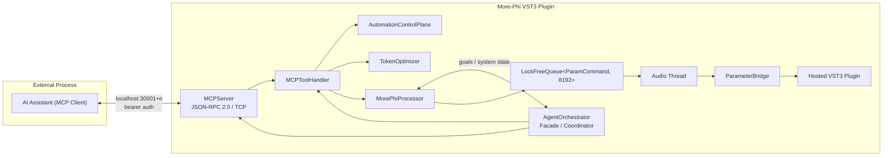
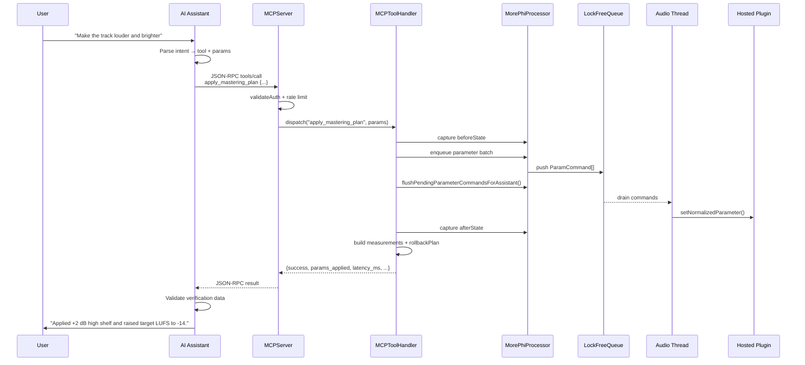

# AI Assistant – MCP – VST3 Plugin Integration Specification

**More-Phi v3.3.0** — Optimized architecture for AI-driven control of a VST3 plugin through an embedded Model Context Protocol (MCP) server.

---

## 1. Executive Summary

This specification defines the optimized integration between an external AI assistant and the More-Phi VST3 plugin. The AI assistant connects to More-Phi's embedded MCP server over a local TCP socket, authenticates with a per-instance bearer token, and invokes discrete tools that control plugin parameters, presets, morphing, analysis, and mastering workflows. The MCP server routes each command to the plugin's non-audio dispatch layer, which applies changes through a real-time-safe `LockFreeQueue` to the audio thread and returns structured verification data. The AI assistant validates the verification payload before confirming the result to the user.

The design prioritizes:

1. **Low latency** — localhost TCP, lock-free command queue, batched parameter updates, tool-result caching.
2. **Verified execution** — every write is wrapped in an `AutomationTransaction` that captures before/after state, measurements, rollback plan, and timing.
3. **Real-time safety** — no locks, no heap allocation, and no blocking on the audio thread after `prepare()`.
4. **Scalability** — per-instance ports/tokens, rate limiting, token budgets, and async execution for long-running tools.

---

## 2. Integration Architecture

### 2.1 Component Overview



| Component | Responsibility | Thread Domain |
|-----------|----------------|---------------|
| **AI Assistant** | Natural-language understanding, intent parsing, tool selection, verification validation, user confirmation | External process |
| **AgentOrchestrator** | Single-initialization facade; registers all 6 agents, starts MCP server, exposes `describeSystemState()` and `submitUserGoal()` | Message thread |
| **MCPServer** | TCP listener, JSON-RPC 2.0 framing, auth, rate-limit check, request dispatch, connection lifecycle | `MorePhi-MCP` + per-connection threads |
| **MCPToolHandler** | Tool dispatch, parameter normalization, transaction wrapping, result serialization | MCP thread |
| **AutomationControlPlane** | `AutomationTransaction`, `ActionLedger`, `PermissionKernel`, `WorkflowOrchestrator`, `MemoryStore` | MCP thread |
| **TokenOptimizer** | Rate limiting, token/cost estimation, batching strategy | MCP thread |
| **MorePhiProcessor** | Owns all subsystems; exposes `enqueueParameterSet/Batch`, state capture, transport context | Message thread (UI/MCP calls) |
| **LockFreeQueue** | Multi-producer/single-consumer ring buffer for `ParamCommand` | Producers: UI/MCP; Consumer: audio thread |
| **Audio Thread** | Drains queue, runs morphing/interpolation, applies parameters via `ParameterBridge` | Audio callback |
| **ParameterBridge** | Maps normalized float vector to hosted plugin parameters | Audio thread |
| **Hosted Plugin** | Target VST3/AU effect/instrument being morphed/hosted | Audio thread |

### 2.2 Request/Verification Sequence



### 2.3 Threading Model

```
┌─────────────────────────────────────────────────────────────────────┐
│ Thread Domain          │ Responsibilities                    │ Rules│
├─────────────────────────────────────────────────────────────────────┤
│ Audio Thread           │ processBlock, queue drain,          │ NO   │
│                        │ interpolation, ParameterBridge      │ alloc│
│                        │                                     │ NO   │
│                        │                                     │ locks│
├─────────────────────────────────────────────────────────────────────┤
│ Message Thread         │ UI, Timer callbacks, deferred       │ NO   │
│                        │ plugin loading, state restore       │ audio│
│                        │                                     │ blocking│
├─────────────────────────────────────────────────────────────────────┤
│ MCP Thread             │ JSON-RPC server, tool dispatch,     │ NO   │
│ + Connection Threads   │ auth, rate limit, transaction wrap  │ audio│
│                        │                                     │ calls│
└─────────────────────────────────────────────────────────────────────┘
```

---

## 2.4 Unified Configuration (`EcosystemConfig`)

All VST3 plugin, agent runtime, and MCP server settings are consolidated under a single `EcosystemConfig` object (see `src/AI/Orchestrator/EcosystemConfig.h`). This eliminates scattered `juce::ValueTree` / JSON fragments and guarantees that every subsystem reads from the same validated source of truth.

### 2.4.1 Sub-configurations

| Sub-config | File | Purpose | Key Fields |
|------------|------|---------|------------|
| **MCP** | `McpConfig` | Server socket, auth, rate-limit defaults | `port`, `maxConnections`, `idleTimeoutMs`, `requestByteLimit`, `bearerTokenRotation` |
| **Agent** | `AgentConfig` | Conductor + 5 worker agents, scheduling | `agentPoolSize`, `goalQueueCapacity`, `workerTimeoutMs`, `conductorRefreshHz` |
| **Security** | `SecurityConfig` | Validation rules, auth policy, rate-limit tuning | `tokenHashAlgorithm`, `maxFailedAuthAttempts`, `rateLimitBuckets`, `paramSanitizationMode` |
| **Plugin** | `PluginConfig` | Hosted-plugin defaults, bridge behaviour | `defaultHostedPluginPath`, `autoLoadLastPlugin`, `bridgeHoldAgainstMorphDefault`, `flushTimeoutMs` |

### 2.4.2 Lifecycle

1. **`AgentOrchestrator::start()`** loads the active `EcosystemConfig` (from file if present, else factory defaults).
2. Each sub-config is passed by const-reference to the subsystem that needs it (`MCPServer` gets `McpConfig`, `SecurityValidator` gets `SecurityConfig`, etc.).
3. Hot-reload: changing the config file on disk triggers a hash-based diff; only subsystems whose config slice changed are re-initialised. The audio thread is never interrupted.

### 2.4.3 Cross-subsystem sharing

- **Port & token** — `McpConfig.port` and the generated bearer token are published in the instance descriptor so the AI assistant can discover them.
- **Rate-limit baseline** — `SecurityConfig.rateLimitBuckets` feeds `TokenOptimizer` at start-up; runtime autonomy multipliers (§5.5) are applied on top.
- **Flush timeouts** — `PluginConfig.flushTimeoutMs` is passed to `MorePhiProcessor::flushPendingParameterCommandsForAssistant` as the default bound.

---

## 2.5 Security Layer (`SecurityValidator`)

The `SecurityValidator` (see `src/AI/Orchestrator/SecurityValidator.h`) is a lightweight, stateless gate that runs **before** any JSON-RPC request reaches the tool handler. It is constructed from `SecurityConfig` and owned by `AgentOrchestrator`.

### 2.5.1 API surface

| Method | Purpose |
|--------|---------|
| `validateRequestJson(json)` | Syntax check, schema conformance (reject unknown fields, type mismatches), max-depth enforcement. Returns `McpError` on failure. |
| `validateAuthToken(token)` | Constant-time comparison against the active bearer token; counts failed attempts; locks out after `maxFailedAuthAttempts`. |
| `checkRateLimit(clientId)` | Bucket-token rate limit per `clientId` (derived from `getClientId`). Returns *allow* / *deny* / *retry-after-ms*. |
| `sanitizeParams(params)` | Recursive pass over `params`: strips non-finite floats, clamps strings to `MAX_STRING_LENGTH`, rejects nested objects deeper than `MAX_PARAM_DEPTH`. |
| `getClientId(socket)` | Generates a stable, opaque client identifier from the local socket endpoint (e.g. `127.0.0.1:port` hash) for per-client rate-limit tracking. |

### 2.5.2 Integration into the request pipeline

```
ConnectionThread ──► validateRequestJson ──► validateAuthToken ──► checkRateLimit
                                                      │
                                                      ▼
                                            sanitizeParams ──► MCPToolHandler::handle
```

- **Fail-fast:** any `SecurityValidator` rejection short-circuits the pipeline and returns an `McpError` response immediately; `MCPToolHandler` is never invoked.
- **No audio-thread access:** all validation happens on the connection thread; zero risk of blocking the audio callback.
- **Auth token rotation:** `SecurityConfig` supports scheduled rotation; `validateAuthToken` checks both the current and the previous token during a grace window to avoid race conditions with reconnecting clients.

---

## 3. Tool Mapping Structure

### 3.1 Tool Categories

| Category | Examples | Frequency | Impact |
|----------|----------|-----------|--------|
| **Read/State** | `get_plugin_info`, `list_parameters`, `get_parameter`, `analysis.get_summary` | Very high | Read-only |
| **Parameter Write** | `set_parameter`, `set_parameters_batch`, `more_phi.set_parameter` | High | Low/Medium write |
| **Snapshot/Preset** | `capture_snapshot`, `recall_snapshot`, `hosted_plugin.capture_state` | Medium | State change |
| **Morph Control** | `set_morph_position`, `get_morph_state` | High | Low write |
| **Mastering** | `apply_mastering_plan`, `mastering.plan_preview`, `mastering.render_batch` | Medium | High impact |
| **Workflow** | `workflow.create`, `workflow.submit`, `workflow.execute` | Low | Orchestrates writes |
| **Permissions** | `permission.set_autonomy`, `permission.approve` | Low | Policy change |

### 3.2 Tool Definition Schema

Every tool is advertised in `tools/list` with:

```json
{
  "name": "set_parameters_batch",
  "description": "Set multiple hosted plugin parameters using the realtime-safe queue.",
  "inputSchema": {
    "type": "object",
    "properties": {
      "parameters": {
        "type": "array",
        "items": {
          "type": "object",
          "properties": {
            "stableId": { "type": "string" },
            "index":    { "type": "integer" },
            "name":     { "type": "string" },
            "value":    { "type": "number", "minimum": 0, "maximum": 1 }
          }
        }
      }
    }
  }
}
```

### 3.3 Success/Failure Response Shapes

**Success** (`tools/call` envelope):

```json
{
  "jsonrpc": "2.0",
  "result": {
    "content": [{ "type": "text", "text": "<stringified result>" }],
    "structuredContent": {
      "success": true,
      "params_applied": 42,
      "transaction_id": "txn_...",
      "latency_ms": 12.4,
      "automation": {
        "risk": "low_write",
        "rollback_available": true
      }
    },
    "isError": false
  },
  "id": 1
}
```

**Failure**:

```json
{
  "jsonrpc": "2.0",
  "result": {
    "content": [{ "type": "text", "text": "<stringified result>" }],
    "structuredContent": {
      "success": false,
      "error": "queue_full",
      "details": "LockFreeQueue at 95% capacity",
      "latency_ms": 3.1,
      "suggested_action": "Retry after 50 ms or reduce batch size"
    },
    "isError": true
  },
  "id": 1
}
```

### 3.4 McpProtocol Explicit Schemas

All JSON-RPC parsing, validation, and serialization is formalised through the `McpProtocol` layer (`src/AI/Orchestrator/McpProtocol.h`). This replaces ad-hoc `nlohmann::json` manipulation with strongly-typed structs and deterministic helpers.

**Core structs:**

| Struct | Fields | Purpose |
|--------|--------|---------|
| `McpRequest` | `id`, `method`, `params`, `jsonrpc` | Inbound request after syntactic validation |
| `McpResponse` | `id`, `result`, `error`, `jsonrpc` | Outbound response envelope |
| `McpNotification` | `method`, `params`, `jsonrpc` | Fire-and-forget telemetry (no `id`) |
| `McpError` | `code`, `message`, `data` | Standard JSON-RPC 2.0 error object |

**Helper functions:**

| Function | Behaviour |
|----------|-----------|
| `parseRequest(rawJson)` | Returns `McpRequest` or `McpError` (-32700 on parse failure, -32600 on schema mismatch) |
| `serializeResponse(resp)` | Serialises `McpResponse` to a single line of JSON + `"\n"` |
| `validateRequest(req)` | Semantic validation: checks `jsonrpc == "2.0"`, method is non-empty, params is object/array |
| `validateAuth(req, token)` | Extracts bearer token from `req.params` and performs constant-time comparison |
| `makeErrorResponse(id, code, message, data?)` | Builds a compliant `McpResponse` wrapping an `McpError` |

**Integration:**
- `MCPServer::processRequest` receives raw bytes, calls `McpProtocol::parseRequest`, then `SecurityValidator::validateRequestJson` (which internally reuses `McpProtocol::validateRequest`), and finally emits via `McpProtocol::serializeResponse`.
- `McpProtocol::validateAuth` is the canonical entry point for bearer-token verification; `SecurityValidator::validateAuthToken` delegates to it after extracting the token from the socket-level context.

---

## 4. Execution Verification Protocol

### 4.1 Transaction Wrapper

Every write-capable tool passes through `dispatchWithAutomationTransaction`, which:

1. Classifies risk via `PermissionKernel::evaluate`.
2. Captures `beforeState` = `captureAutomationState()`.
3. Builds a `rollbackPlan` based on the tool type.
4. Executes the tool.
5. Captures `afterState`.
6. Computes `measurements` (changed parameter count, max delta, morph deltas, queue pending).
7. Records the transaction in the `ActionLedger`.

### 4.2 Verification Payload

Write-capable tools (`set_parameter`, `set_parameters_batch`, `more_phi.set_parameter`,
etc.) return a per-edit `verification` object that classifies the outcome.

**Single-parameter verification:**
```json
{
  "success": true,
  "index": 0,
  "value": 0.75,
  "queued": 1,
  "appliedNow": 1,
  "pendingAfter": 0,
  "flush": {
    "pending_before": 1,
    "drained": 1,
    "pending_after": 0,
    "plugin_unavailable": false,
    "exclusive_access_timed_out": false,
    "retry_count": 0,
    "waited_ms": 5,
    "out_of_range_count": 0
  },
  "verification": {
    "status": "success",
    "requested_value": 0.75,
    "value_before": 0.5,
    "value_after": 0.75,
    "human_before": "50%",
    "human_after": "75%",
    "execution_time_ms": 12.4,
    "verified": true
  }
}
```

**Verification status values (AUDIT-FIX 4.1/4.3/4.5/4.7):**

| Status | `verified` | Meaning |
|--------|-----------|---------|
| `success` | `true` | Value applied and confirmed within tolerance |
| `queued` | `false` | Command enqueued but not yet drained to plugin |
| `value_drift` | `false` | Continuous parameter: applied value differs from requested |
| `value_drift_discrete` | `false` | Discrete parameter: snapped to different step than requested |
| `morph_overwrite_risk` | `false` | Morph engine likely overwrote the edit on the next block |
| `parameter_index_out_of_range` | `false` | Index exceeds hosted plugin's actual parameter count |
| `failure` | `false` | Queue full, parameter unresolved, or other error |

**IMPORTANT (AUDIT-FIX 4.3):** The top-level `success` field is now gated on
`verification.verified == true`. A response with `success: false` and
`verification.status: "queued"` means the edit is pending — not rejected.
Always check `verification.status` before assuming failure.

### 4.3 AI-Side Validation

The AI assistant MUST validate:

1. `success == true` — but note AUDIT-FIX 4.3: `success` is gated on actual
   verification. A `false` with `verification.status == "queued"` is transient.
2. `verification.status == "success"` for each edited parameter.
3. The set of changed parameters matches the requested action.
4. `flush.out_of_range_count == 0` — non-zero means some indices exceeded the
   plugin's parameter count (AUDIT-FIX 4.7).
5. `queue.healthy == true`.
6. No high-impact parameters were modified unexpectedly.
7. `verification.status` is not `"morph_overwrite_risk"` — if it is, suggest
   pausing morph before re-applying the edit (AUDIT-FIX 4.5).
8. For discrete parameters, check for `"value_drift_discrete"` and suggest
   choosing a valid step value (AUDIT-FIX 4.1).

If validation fails, the AI assistant should:

1. Call `automation.rollback` with the `transaction_id` if rollback is available.
2. Report the specific `verification.status` and `verification.corrective_action`
   to the user.
3. Suggest a corrected request based on the error reason.

### 4.4 Neural Path Verification (SonicMaster)

The neural mastering subsystem (`OzonePlanApplicator`) provides a second edit entry point alongside MCP `set_parameter`. Both funnel through `enqueueParameterSet` → `LockFreeQueue` → audio-thread drain → `ParameterBridge`, with aligned safety properties:

| Property | MCP/agent path | Neural path (`OzonePlanApplicator`) |
|----------|----------------|--------------------------------------|
| ParamID resolution | Live re-query via `resolveParameter` | Positional indices, re-validated by name in `enqueueIfMapped` |
| Hold against morph | `holdAgainstMorph=true` | `holdAgainstMorph=true` |
| Read-back verification | `classifyVerification` → 7 status codes | `getLastApplyVerification()` / `lastApplyWasPartial()` |
| Action-ledger record | Standard MCP ledger entry | Ledger cap 4096 (`kLedgerMaxTransactions`) |
| Plan atomicity | N/A | `enqueuePlanBoundary()` + `lastDrainedPlanId_` atomic marker |
| Transition guard | N/A | `notifyHostedParameterChanged()` + ring flush |

**Additional neural path details:**
- ONNX model embedded in binary via `BinaryData::getNamedResource()` — no runtime file I/O
- Capture ring rate-proportional (`8.0 * sampleRate`, clamped `[2×44100, 32×192000]`), lazily allocated
- Resampling uses `resamplePolyphase` (not linear interpolation)
- Mono capture supported (`channelCount == 1`)
- Plan application uses pending-plan atomic-flag pattern — stores in `pendingPlan_`, applies in `runCycle` on analysis thread (no `callAsync`)
- EQ gain normalization capped at ±12 dB via `AdaptiveEQ::kMaxGainDB`
- `mastering.render_batch` dry-run populates real `lufs_error` per candidate for `OptimizationAgent` scoring

---

## 5. Performance Optimization Strategies

### 5.1 Intent Pre-Parsing

The AI assistant pre-parses user requests into `(intent, target_tool, params)` before opening the MCP socket, reducing server-side interpretation time.

**Pseudocode:**

```python
def parse_user_request(text: str) -> ToolCall:
    intent = classify_intent(text)        # e.g. "adjust_eq"
    tool = map_intent_to_tool(intent)     # e.g. "eq_adjust"
    params = extract_params(text, intent) # schema-constrained
    return ToolCall(tool, params)
```

### 5.2 Tool Result Caching

Read-only/high-frequency tools are cached per instance. Cache keys are `(tool_name, normalized_params, plugin_generation_token)`. Invalidation occurs on plugin load, snapshot recall, or TTL expiry.

**Cached tools:**

- `get_plugin_info`
- `list_parameters`
- `hosted_plugin.parameters`
- `plugin_profile.describe_semantics`
- `analysis.get_summary`

**Pseudocode:**

```cpp
struct ToolResultCache {
    std::optional<json> get(const String& tool, const var& params,
                            uint64_t generationToken);
    void put(const String& tool, const var& params,
             uint64_t generationToken, const json& result,
             std::chrono::seconds ttl);
    void invalidateOnPluginLoad();
};
```

### 5.3 Parameter Batching

Multiple parameter changes are coalesced into a single `enqueueParameterBatch` call. The `TokenOptimizer` supports `Immediate`, `Debounce100ms`, `Debounce500ms`, `OnSnapshot`, and `Manual` batch strategies.

**Pseudocode:**

```cpp
std::vector<ParamCommand> commands;
commands.reserve(updates.size());
for (auto& u : updates) {
    commands.push_back({u.index, u.value, false, -1,
                        ParameterEditSource::MCP, true, false, 0});
    //             {paramIndex, value, isSnapshotMarker, snapshotSlot,
    //              source, holdAgainstMorph, isPlanBoundary, planId}
}
processor.enqueueParameterBatch(commands);
auto flush = processor.flushPendingParameterCommandsForAssistant(
    static_cast<int>(commands.size()), 75);
```

### 5.4 Asynchronous Tool Execution

Long-running tools (`mastering.render_batch`, `run_self_test`, `ozone_run_assistant_ipc`) return a `job_id` immediately and run on a background thread. Clients poll `async_tool.status`.

**Pseudocode:**

```cpp
struct AsyncToolExecutor {
    String submit(String toolName, var params,
                  std::function<String()> work);
    json status(const String& jobId);
    json result(const String& jobId);
};
```

### 5.5 Rate Limiting & Backpressure

- `TokenOptimizer::tryConsumeRequestSlot()` enforces requests-per-minute limits.
- `LockFreeQueue` usage is monitored; if `usage > 0.8`, the server returns `queue_full` with retry guidance.
- `PerformanceProfiler` tracks tool execution latency for optimization tuning.

### 5.6 Latency Budgets

| Phase | Target | Measurement |
|-------|--------|-------------|
| Intent parsing | < 50 ms | AI assistant internal |
| TCP + JSON-RPC parse | < 5 ms | `MCPServer::processRequest` |
| Auth + rate limit | < 1 ms | `SecurityValidator::validateAuthToken` + `tryConsumeRequestSlot` |
| Tool dispatch | < 10 ms | `MCPToolHandler::handle` |
| Queue flush (typical batch) | < 20 ms | `flushPendingParameterCommandsForAssistant` |
| Audio-thread apply | < 1 block | Audio callback |
| Verification response | < 5 ms | state capture + diff |
| **End-to-end** | **< 100 ms** | AI assistant measured |

---

## 6. Pseudocode & Data Flow

### 6.1 AI Assistant Dispatch Loop

```python
class AIAssistant:
    def handle_user_request(self, text: str) -> str:
        call = self.parse_intent(text)
        if not call:
            return ask_clarification(text)

        # Optional: preview diff for write tools
        if call.tool in WRITE_TOOLS:
            preview = self.mcp.call("automation.diff_preview", {
                "tool_name": call.tool,
                "params": call.params
            })
            if not self.user_approves(preview):
                return "Cancelled."

        result = self.mcp.call("tools/call", {
            "name": call.tool,
            "arguments": call.params
        })

        if not self.verify_result(result):
            if result.get("rollback_available"):
                self.mcp.call("automation.rollback", {
                    "transaction_id": result["transaction_id"]
                })
            return format_failure(result)

        return format_success(result)
```

### 6.2 MCP Server Request Handler

```cpp
juce::String MCPServer::processRequest(const juce::String& jsonRequest,
                                       bool& authenticated) {
    auto parsed = McpProtocol::parseRequest(jsonRequest.toStdString());
    if (parsed.isError())
        return McpProtocol::makeErrorResponse(nullptr, -32700, "Parse error");

    auto req = parsed.request();
    if (!McpProtocol::validateRequest(req))
        return McpProtocol::makeErrorResponse(req.id, -32600, "Invalid Request");

    if (req.method == "initialize") {
        if (securityValidator_.validateAuthToken(req.params["bearer_token"])) {
            authenticated = true;
            return McpProtocol::serializeResponse(McpProtocol::makeInitResponse(req.id, identity_));
        }
        return McpProtocol::makeErrorResponse(req.id, -32001, "Unauthorized");
    }
    if (!authenticated)
        return McpProtocol::makeErrorResponse(req.id, -32001, "Unauthorized");
    if (!securityValidator_.checkRateLimit(getClientId()))
        return McpProtocol::makeErrorResponse(req.id, -32000, "Rate limit exceeded");

    auto t0 = std::chrono::high_resolution_clock::now();
    auto result = MCPToolHandler::handle(req.method, req.params, processor_,
                                         identity_, automationRuntime_);
    auto latency = std::chrono::duration<double, std::milli>(
        std::chrono::high_resolution_clock::now() - t0).count();

    auto embedded = json::parse(result.toStdString());
    embedded["latency_ms"] = latency;
    return McpProtocol::serializeResponse(McpProtocol::makeToolResponse(req.id, embedded, req.method == "tools/call"));
}
```

### 6.3 Verified Parameter Write

```cpp
juce::String setParametersBatch(const juce::var& params, MorePhiProcessor& p) {
    auto batch = params.getProperty("parameters", params.getProperty("params", {}));
    std::vector<ParamCommand> commands;
    for (auto& item : *batch.getArray()) {
        auto resolution = p.getParameterBridge().resolveParameter(
            item["stableId"], item["index"], item["name"]);
        if (!resolution.success) continue;
        commands.push_back({resolution.index,
                            static_cast<float>(item["value"]),
                            false, -1,
                            ParameterEditSource::MCP, true, false, 0});
    }

    if (!p.enqueueParameterBatch(commands))
        return toJString({{"success", false},
                          {"error", "queue_full"},
                          {"suggested_action", "Retry with smaller batch"}});

    auto flush = p.flushPendingParameterCommandsForAssistant(
        static_cast<int>(commands.size()), 75);

    return toJString({
        {"success", true},
        {"params_applied", static_cast<int>(commands.size())},
        {"flush", parameterFlushToJson(flush)}
    });
}
```

---

## 7. Security & Thread Safety

| Concern | Mitigation |
|---------|------------|
| Unauthorized access | Per-instance bearer token; constant-time comparison in `SecurityValidator::validateAuthToken()` |
| Remote access | `127.0.0.1` only; non-local connections rejected |
| Resource exhaustion | Max 4 concurrent connections; 256 KB request limit; rate limiting |
| Audio-thread safety | All parameter writes go through `LockFreeQueue`; no locks/allocs on audio thread |
| State integrity | `AutomationTransaction` before/after snapshots; rollback plans |
| Timing attacks | `constantTimeEqual` for token comparison |
| Instance isolation | Unique port + token generated via platform CSPRNG; `InstanceRegistry` manages up to 64 instances |

---

## 8. References

- `src/AI/MCPServer.h` / `src/AI/MCPServer.cpp` — MCP JSON-RPC server
- `src/AI/MCPToolHandler.h` / `src/AI/MCPToolHandler.cpp` — tool dispatch
- `src/AI/ToolResultCache.h` / `src/AI/ToolResultCache.cpp` — read-only tool result cache
- `src/AI/AsyncToolExecutor.h` / `src/AI/AsyncToolExecutor.cpp` — background tool execution
- `src/AI/AutomationControlPlane.h` / `src/AI/AutomationControlPlane.cpp` — transactions, permissions, workflows, memory
- `src/AI/TokenOptimizer.h` / `src/AI/TokenOptimizer.cpp` — rate limits and token budgets
- `src/AI/Orchestrator/AgentOrchestrator.h` — single-initialization facade, agent registration, goal submission
- `src/AI/Orchestrator/EcosystemConfig.h` — unified configuration (MCP, Agent, Security, Plugin sub-configs)
- `src/AI/Orchestrator/SecurityValidator.h` — request validation, auth, rate-limit, param sanitization
- `src/AI/Orchestrator/McpProtocol.h` — explicit JSON-RPC structs and serialisation helpers
- `src/Plugin/PluginProcessor.h` — `MorePhiProcessor`, `ParamCommand`, queue accessors
- `src/Core/LockFreeQueue.h` — real-time-safe command queue
- `src/Core/PerformanceProfiler.h` — latency profiling
- `docs/MCP_OZONE_IMPLEMENTATION_GUIDE.md` — Ozone-specific MCP workflow
- `specs/005-ai-mcp-vst3-integration/plan.md` — prior gap-analysis and target-architecture plan

---

## 9. Revision History

| Version | Date | Author | Changes |
|---------|------|--------|---------|
| 1.0 | 2026-06-17 | Kimi Code CLI | Initial architecture, tool mapping, verification, and optimization spec |
| 1.1 | 2026-06-20 | Kimi Code CLI | Added `AgentOrchestrator` to architecture diagram and component table; added §2.4 `EcosystemConfig` (unified configuration) and §2.5 `SecurityValidator` (security layer); added §3.4 `McpProtocol` explicit schemas; updated §6.2 pseudocode to use `McpProtocol` helpers; updated §8 references to include new Orchestrator headers. |
| 1.2 | 2026-07-23 | Codex Audit | Updated §4.2 verification payload with per-edit verification schema and 7 status codes (success/queued/value_drift/value_drift_discrete/morph_overwrite_risk/parameter_index_out_of_range/failure); updated §4.3 AI-side validation with 8-point checklist covering discrete tolerance, morph overwrite detection, out-of-range detection, and verification-status-gated success; added flush.out_of_range_count field. |
| 1.3 | 2026-06-25 | Doc sync | Added §4.4 neural path verification (SonicMaster/OzonePlanApplicator) with aligned safety properties table; updated §5.3 and §6.3 ParamCommand pseudocode to include `isPlanBoundary` and `planId` fields (P3.10); documented ONNX binary embedding, rate-proportional capture ring, polyphase resampling, pending-plan pattern, mono capture, EQ ±12 dB normalization, `lufs_error` scoring, plan boundary markers, action ledger cap 4096. |
