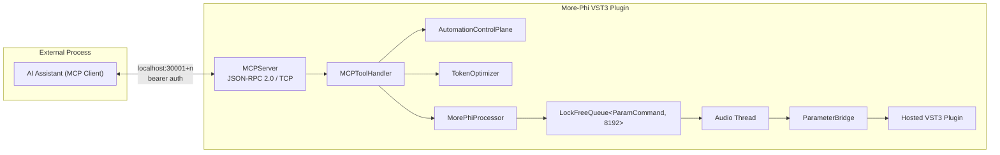
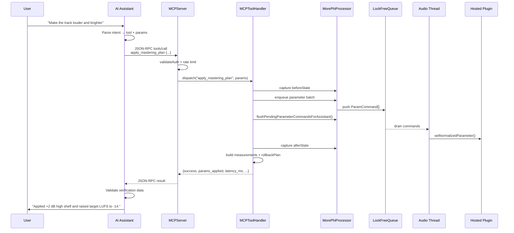

# AI Assistant – MCP – VST3 Plugin Integration Specification

**More-Phi v3.3.0** — Optimized architecture for AI-driven control of a VST3 plugin through an embedded Model Context Protocol (MCP) server.

---

## 1. Executive Summary

This specification defines the optimized integration between an external AI assistant and the More-Phi VST3 plugin. The AI assistant connects to More-Phi's embedded MCP server over a local TCP socket, authenticates with a per-instance bearer token, and invokes discrete tools that control plugin parameters, presets, morphing, analysis, and mastering workflows. The MCP server routes each command to the plugin's non-audio dispatch layer, which applies changes through a real-time-safe `LockFreeQueue` to the audio thread and returns structured verification data. The AI assistant validates the verification payload before confirming the result to the user.

The design prioritizes:

1. **Low latency** — localhost TCP, lock-free command queue, batched parameter updates, tool-result caching.
2. **Verified execution** — every write is wrapped in an `AutomationTransaction` that captures before/after state, measurements, rollback plan, and timing.
3. **Real-time safety** — no locks, no heap allocation, and no blocking on the audio thread after `prepare()`.
4. **Scalability** — per-instance ports/tokens, rate limiting, token budgets, and async execution for long-running tools.

---

## 2. Integration Architecture

### 2.1 Component Overview



| Component | Responsibility | Thread Domain |
|-----------|----------------|---------------|
| **AI Assistant** | Natural-language understanding, intent parsing, tool selection, verification validation, user confirmation | External process |
| **MCPServer** | TCP listener, JSON-RPC 2.0 framing, auth, rate-limit check, request dispatch, connection lifecycle | `MorePhi-MCP` + per-connection threads |
| **MCPToolHandler** | Tool dispatch, parameter normalization, transaction wrapping, result serialization | MCP thread |
| **AutomationControlPlane** | `AutomationTransaction`, `ActionLedger`, `PermissionKernel`, `WorkflowOrchestrator`, `MemoryStore` | MCP thread |
| **TokenOptimizer** | Rate limiting, token/cost estimation, batching strategy | MCP thread |
| **MorePhiProcessor** | Owns all subsystems; exposes `enqueueParameterSet/Batch`, state capture, transport context | Message thread (UI/MCP calls) |
| **LockFreeQueue** | Multi-producer/single-consumer ring buffer for `ParamCommand` | Producers: UI/MCP; Consumer: audio thread |
| **Audio Thread** | Drains queue, runs morphing/interpolation, applies parameters via `ParameterBridge` | Audio callback |
| **ParameterBridge** | Maps normalized float vector to hosted plugin parameters | Audio thread |
| **Hosted Plugin** | Target VST3/AU effect/instrument being morphed/hosted | Audio thread |

### 2.2 Request/Verification Sequence



### 2.3 Threading Model

```
┌─────────────────────────────────────────────────────────────────────┐
│ Thread Domain          │ Responsibilities                    │ Rules│
├─────────────────────────────────────────────────────────────────────┤
│ Audio Thread           │ processBlock, queue drain,          │ NO   │
│                        │ interpolation, ParameterBridge      │ alloc│
│                        │                                     │ NO   │
│                        │                                     │ locks│
├─────────────────────────────────────────────────────────────────────┤
│ Message Thread         │ UI, Timer callbacks, deferred       │ NO   │
│                        │ plugin loading, state restore       │ audio│
│                        │                                     │ blocking│
├─────────────────────────────────────────────────────────────────────┤
│ MCP Thread             │ JSON-RPC server, tool dispatch,     │ NO   │
│ + Connection Threads   │ auth, rate limit, transaction wrap  │ audio│
│                        │                                     │ calls│
└─────────────────────────────────────────────────────────────────────┘
```

---

## 3. Tool Mapping Structure

### 3.1 Tool Categories

| Category | Examples | Frequency | Impact |
|----------|----------|-----------|--------|
| **Read/State** | `get_plugin_info`, `list_parameters`, `get_parameter`, `analysis.get_summary` | Very high | Read-only |
| **Parameter Write** | `set_parameter`, `set_parameters_batch`, `more_phi.set_parameter` | High | Low/Medium write |
| **Snapshot/Preset** | `capture_snapshot`, `recall_snapshot`, `hosted_plugin.capture_state` | Medium | State change |
| **Morph Control** | `set_morph_position`, `get_morph_state` | High | Low write |
| **Mastering** | `apply_mastering_plan`, `mastering.plan_preview`, `mastering.render_batch` | Medium | High impact |
| **Workflow** | `workflow.create`, `workflow.submit`, `workflow.execute` | Low | Orchestrates writes |
| **Permissions** | `permission.set_autonomy`, `permission.approve` | Low | Policy change |

### 3.2 Tool Definition Schema

Every tool is advertised in `tools/list` with:

```json
{
  "name": "set_parameters_batch",
  "description": "Set multiple hosted plugin parameters using the realtime-safe queue.",
  "inputSchema": {
    "type": "object",
    "properties": {
      "parameters": {
        "type": "array",
        "items": {
          "type": "object",
          "properties": {
            "stableId": { "type": "string" },
            "index":    { "type": "integer" },
            "name":     { "type": "string" },
            "value":    { "type": "number", "minimum": 0, "maximum": 1 }
          }
        }
      }
    }
  }
}
```

### 3.3 Success/Failure Response Shapes

**Success** (`tools/call` envelope):

```json
{
  "jsonrpc": "2.0",
  "result": {
    "content": [{ "type": "text", "text": "<stringified result>" }],
    "structuredContent": {
      "success": true,
      "params_applied": 42,
      "transaction_id": "txn_...",
      "latency_ms": 12.4,
      "automation": {
        "risk": "low_write",
        "rollback_available": true
      }
    },
    "isError": false
  },
  "id": 1
}
```

**Failure**:

```json
{
  "jsonrpc": "2.0",
  "result": {
    "content": [{ "type": "text", "text": "<stringified result>" }],
    "structuredContent": {
      "success": false,
      "error": "queue_full",
      "details": "LockFreeQueue at 95% capacity",
      "latency_ms": 3.1,
      "suggested_action": "Retry after 50 ms or reduce batch size"
    },
    "isError": true
  },
  "id": 1
}
```

---

## 4. Execution Verification Protocol

### 4.1 Transaction Wrapper

Every write-capable tool passes through `dispatchWithAutomationTransaction`, which:

1. Classifies risk via `PermissionKernel::evaluate`.
2. Captures `beforeState` = `captureAutomationState()`.
3. Builds a `rollbackPlan` based on the tool type.
4. Executes the tool.
5. Captures `afterState`.
6. Computes `measurements` (changed parameter count, max delta, morph deltas, queue pending).
7. Records the transaction in the `ActionLedger`.

### 4.2 Verification Payload

```json
{
  "success": true,
  "transaction_id": "txn_a1b2c3d4",
  "tool": "set_parameters_batch",
  "latency_ms": 8.7,
  "params_applied": 12,
  "changes": {
    "hosted_parameter_changed_count": 12,
    "hosted_parameter_max_delta": 0.18,
    "more_phi_morph_delta": 0.0
  },
  "before_state_checksum": 1234567890,
  "after_state_checksum": 9876543210,
  "rollback_available": true,
  "rollback_plan": {
    "available": true,
    "kind": "hosted_parameter_state",
    "method": "automation.rollback"
  },
  "queue": {
    "healthy": true,
    "usage": 0.12,
    "pending": 0
  },
  "automation": {
    "risk": "low_write",
    "autonomy_level": "assist"
  }
}
```

### 4.3 AI-Side Validation

The AI assistant MUST validate:

1. `success == true`.
2. The set of changed parameters matches the requested action.
3. `queue.healthy == true`.
4. No high-impact parameters were modified unexpectedly.
5. Rollback is available for writes (`rollback_available == true`).

If validation fails, the AI assistant should:

1. Call `automation.rollback` with the `transaction_id`.
2. Report the discrepancy to the user.
3. Suggest a corrected request.

---

## 5. Performance Optimization Strategies

### 5.1 Intent Pre-Parsing

The AI assistant pre-parses user requests into `(intent, target_tool, params)` before opening the MCP socket, reducing server-side interpretation time.

**Pseudocode:**

```python
def parse_user_request(text: str) -> ToolCall:
    intent = classify_intent(text)        # e.g. "adjust_eq"
    tool = map_intent_to_tool(intent)     # e.g. "eq_adjust"
    params = extract_params(text, intent) # schema-constrained
    return ToolCall(tool, params)
```

### 5.2 Tool Result Caching

Read-only/high-frequency tools are cached per instance. Cache keys are `(tool_name, normalized_params, plugin_generation_token)`. Invalidation occurs on plugin load, snapshot recall, or TTL expiry.

**Cached tools:**

- `get_plugin_info`
- `list_parameters`
- `hosted_plugin.parameters`
- `plugin_profile.describe_semantics`
- `analysis.get_summary`

**Pseudocode:**

```cpp
struct ToolResultCache {
    std::optional<json> get(const String& tool, const var& params,
                            uint64_t generationToken);
    void put(const String& tool, const var& params,
             uint64_t generationToken, const json& result,
             std::chrono::seconds ttl);
    void invalidateOnPluginLoad();
};
```

### 5.3 Parameter Batching

Multiple parameter changes are coalesced into a single `enqueueParameterBatch` call. The `TokenOptimizer` supports `Immediate`, `Debounce100ms`, `Debounce500ms`, `OnSnapshot`, and `Manual` batch strategies.

**Pseudocode:**

```cpp
std::vector<ParamCommand> commands;
commands.reserve(updates.size());
for (auto& u : updates) {
    commands.push_back({u.index, u.value, false, -1,
                        ParameterEditSource::MCP, true});
}
processor.enqueueParameterBatch(commands);
auto flush = processor.flushPendingParameterCommandsForAssistant(
    static_cast<int>(commands.size()), 75);
```

### 5.4 Asynchronous Tool Execution

Long-running tools (`mastering.render_batch`, `run_self_test`, `ozone_run_assistant_ipc`) return a `job_id` immediately and run on a background thread. Clients poll `async_tool.status`.

**Pseudocode:**

```cpp
struct AsyncToolExecutor {
    String submit(String toolName, var params,
                  std::function<String()> work);
    json status(const String& jobId);
    json result(const String& jobId);
};
```

### 5.5 Rate Limiting & Backpressure

- `TokenOptimizer::tryConsumeRequestSlot()` enforces requests-per-minute limits.
- `LockFreeQueue` usage is monitored; if `usage > 0.8`, the server returns `queue_full` with retry guidance.
- `PerformanceProfiler` tracks tool execution latency for optimization tuning.

### 5.6 Latency Budgets

| Phase | Target | Measurement |
|-------|--------|-------------|
| Intent parsing | < 50 ms | AI assistant internal |
| TCP + JSON-RPC parse | < 5 ms | `MCPServer::processRequest` |
| Auth + rate limit | < 1 ms | `validateAuth` + `tryConsumeRequestSlot` |
| Tool dispatch | < 10 ms | `MCPToolHandler::handle` |
| Queue flush (typical batch) | < 20 ms | `flushPendingParameterCommandsForAssistant` |
| Audio-thread apply | < 1 block | Audio callback |
| Verification response | < 5 ms | state capture + diff |
| **End-to-end** | **< 100 ms** | AI assistant measured |

---

## 6. Pseudocode & Data Flow

### 6.1 AI Assistant Dispatch Loop

```python
class AIAssistant:
    def handle_user_request(self, text: str) -> str:
        call = self.parse_intent(text)
        if not call:
            return ask_clarification(text)

        # Optional: preview diff for write tools
        if call.tool in WRITE_TOOLS:
            preview = self.mcp.call("automation.diff_preview", {
                "tool_name": call.tool,
                "params": call.params
            })
            if not self.user_approves(preview):
                return "Cancelled."

        result = self.mcp.call("tools/call", {
            "name": call.tool,
            "arguments": call.params
        })

        if not self.verify_result(result):
            if result.get("rollback_available"):
                self.mcp.call("automation.rollback", {
                    "transaction_id": result["transaction_id"]
                })
            return format_failure(result)

        return format_success(result)
```

### 6.2 MCP Server Request Handler

```cpp
juce::String MCPServer::processRequest(const juce::String& jsonRequest,
                                       bool& authenticated) {
    auto parsed = json::parse(jsonRequest.toStdString());
    auto method = parsed["method"].get<std::string>();
    auto params = jsonToJuceVar(parsed.value("params", json::object()));
    auto reqId  = parsed.value("id", nullptr);

    if (method == "initialize") {
        if (validateAuth(params)) { authenticated = true; return makeInitResponse(reqId); }
        return errResponse(-32001, "Unauthorized");
    }
    if (!authenticated) return errResponse(-32001, "Unauthorized");
    if (!processor_.getTokenOptimizer().tryConsumeRequestSlot())
        return errResponse(-32000, "Rate limit exceeded");

    auto t0 = std::chrono::high_resolution_clock::now();
    auto result = MCPToolHandler::handle(method, params, processor_,
                                         identity_, automationRuntime_);
    auto latency = std::chrono::duration<double, std::milli>(
        std::chrono::high_resolution_clock::now() - t0).count();

    auto embedded = json::parse(result.toStdString());
    embedded["latency_ms"] = latency;
    return makeToolResponse(reqId, embedded, method == "tools/call");
}
```

### 6.3 Verified Parameter Write

```cpp
juce::String setParametersBatch(const juce::var& params, MorePhiProcessor& p) {
    auto batch = params.getProperty("parameters", params.getProperty("params", {}));
    std::vector<ParamCommand> commands;
    for (auto& item : *batch.getArray()) {
        auto resolution = p.getParameterBridge().resolveParameter(
            item["stableId"], item["index"], item["name"]);
        if (!resolution.success) continue;
        commands.push_back({resolution.index,
                            static_cast<float>(item["value"]),
                            false, -1,
                            ParameterEditSource::MCP, true});
    }

    if (!p.enqueueParameterBatch(commands))
        return toJString({{"success", false},
                          {"error", "queue_full"},
                          {"suggested_action", "Retry with smaller batch"}});

    auto flush = p.flushPendingParameterCommandsForAssistant(
        static_cast<int>(commands.size()), 75);

    return toJString({
        {"success", true},
        {"params_applied", static_cast<int>(commands.size())},
        {"flush", parameterFlushToJson(flush)}
    });
}
```

---

## 7. Security & Thread Safety

| Concern | Mitigation |
|---------|------------|
| Unauthorized access | Per-instance bearer token; constant-time comparison in `validateAuth()` |
| Remote access | `127.0.0.1` only; non-local connections rejected |
| Resource exhaustion | Max 4 concurrent connections; 256 KB request limit; rate limiting |
| Audio-thread safety | All parameter writes go through `LockFreeQueue`; no locks/allocs on audio thread |
| State integrity | `AutomationTransaction` before/after snapshots; rollback plans |
| Timing attacks | `constantTimeEqual` for token comparison |
| Instance isolation | Unique port + token generated via platform CSPRNG; `InstanceRegistry` manages up to 64 instances |

---

## 8. References

- `src/AI/MCPServer.h` / `src/AI/MCPServer.cpp` — MCP JSON-RPC server
- `src/AI/MCPToolHandler.h` / `src/AI/MCPToolHandler.cpp` — tool dispatch
- `src/AI/ToolResultCache.h` / `src/AI/ToolResultCache.cpp` — read-only tool result cache
- `src/AI/AsyncToolExecutor.h` / `src/AI/AsyncToolExecutor.cpp` — background tool execution
- `src/AI/AutomationControlPlane.h` / `src/AI/AutomationControlPlane.cpp` — transactions, permissions, workflows, memory
- `src/AI/TokenOptimizer.h` / `src/AI/TokenOptimizer.cpp` — rate limits and token budgets
- `src/Plugin/PluginProcessor.h` — `MorePhiProcessor`, `ParamCommand`, queue accessors
- `src/Core/LockFreeQueue.h` — real-time-safe command queue
- `src/Core/PerformanceProfiler.h` — latency profiling
- `docs/MCP_OZONE_IMPLEMENTATION_GUIDE.md` — Ozone-specific MCP workflow
- `specs/005-ai-mcp-vst3-integration/plan.md` — prior gap-analysis and target-architecture plan

---

## 9. Revision History

| Version | Date | Author | Changes |
|---------|------|--------|---------|
| 1.0 | 2026-06-17 | Kimi Code CLI | Initial architecture, tool mapping, verification, and optimization spec |
