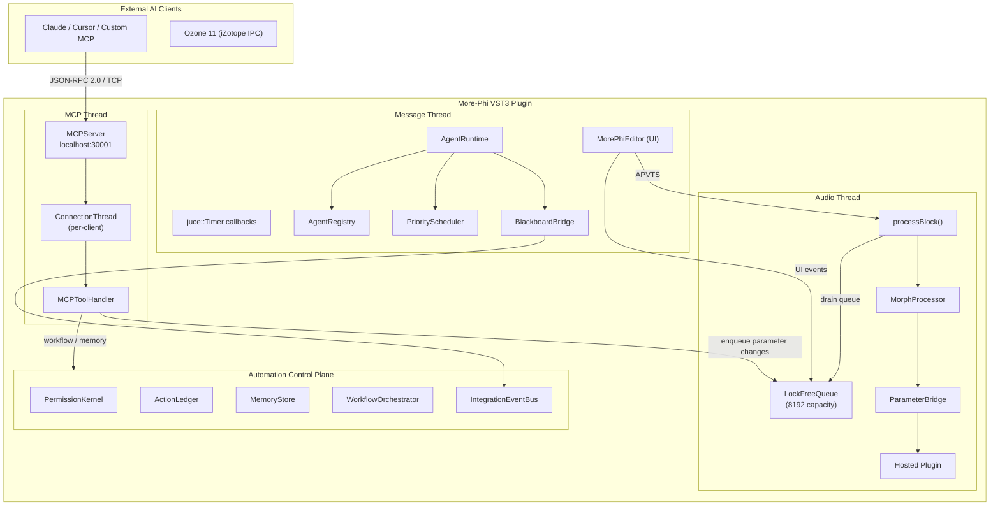
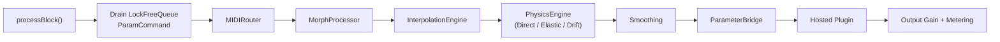
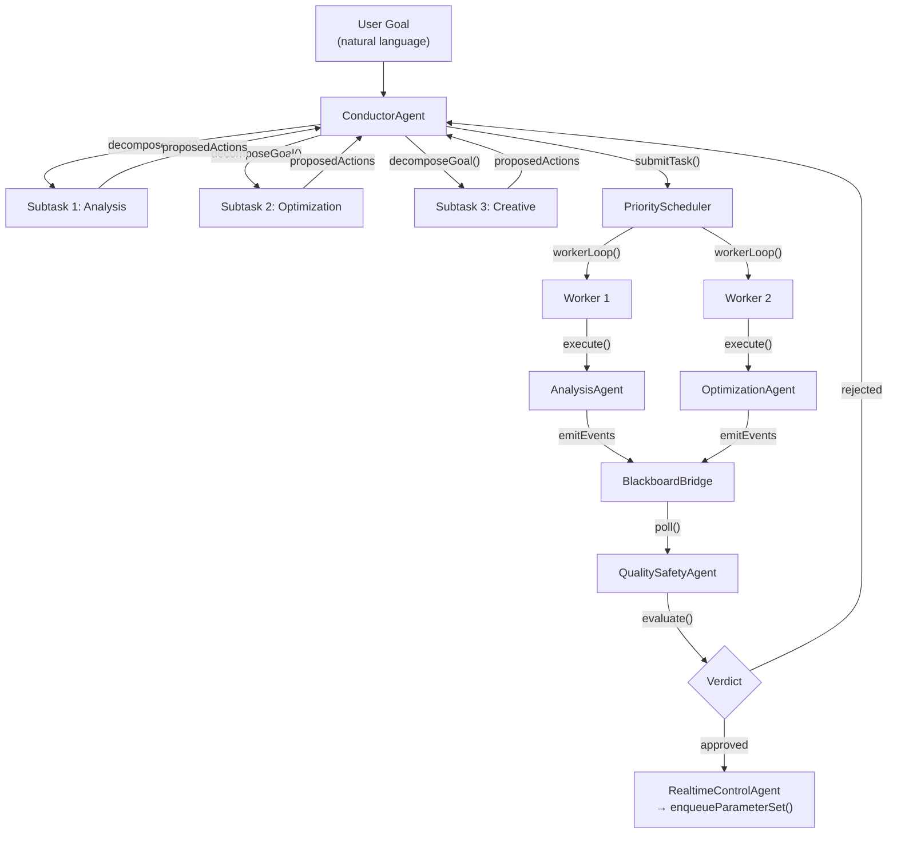
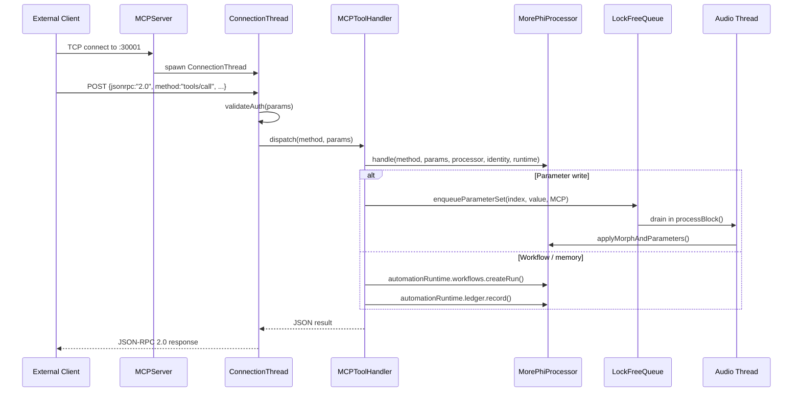
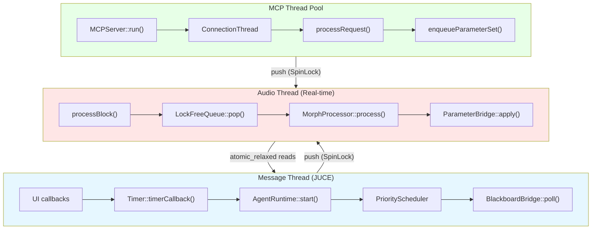
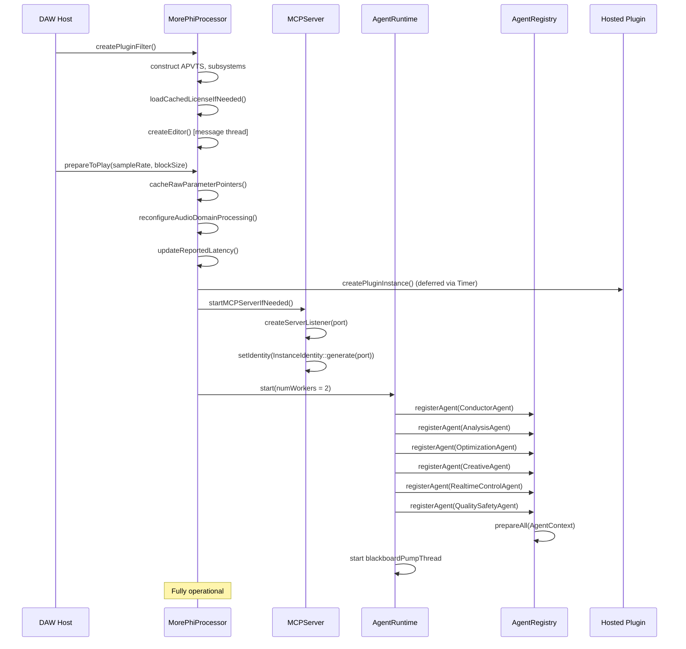
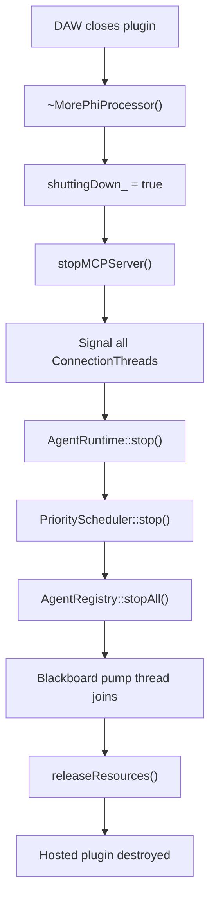

# More-Phi Multi-Agent Ecosystem — Technical Reference

> **Version:** 3.4.1 (Commercial Hardening)  
> **Last Updated:** 2026-06-27  
> **Scope:** Complete architectural reference for the VST3 plugin, multi-agent orchestration layer, MCP server, and integration protocols.  

---

## 1. Executive Summary

The **More-Phi Multi-Agent Ecosystem** is a JUCE 8-based VST3/AU audio plugin that hosts other plugins and morphs between parameter snapshots using physics-based interpolation, genetic breeding, and AI-driven automation via an embedded MCP (Model Context Protocol) server. It enables external AI clients to inspect, control, and optimize hosted plugin parameters in real time through a JSON-RPC 2.0 interface, while a built-in multi-agent system coordinates autonomous audio analysis, optimization, creative suggestion, and safety verification.

### Key Components

| Component | Role | Technology |
|-----------|------|------------|
| `MorePhiProcessor` | VST3/AU audio processor, hosts other plugins | JUCE 8, C++20 |
| `AgentRuntime` | Multi-agent orchestration coordinator | Custom C++ (JUCE + nlohmann/json) |
| `MCPServer` | Embedded JSON-RPC 2.0 server for external AI clients | JUCE `StreamingSocket`, TCP port 30001 |
| `LockFreeQueue` | Thread-safe SPSC ring buffer for real-time parameter commands | Lock-free, power-of-2 capacity |
| `MorphProcessor` | Physics-based interpolation engine (Direct / Elastic / Drift) | Real-time safe, zero-alloc |
| `AutomationRuntime` | Workflow orchestrator, permission kernel, memory store, action ledger | File-backed persistence |
| `ParameterBridge` | Normalized float vector → hosted plugin parameter writes | JUCE `AudioPluginInstance` |
| `BlackboardBridge` | Typed pub/sub event bus over `IntegrationEventBus` | Mutex-protected, message-thread only |

---

## 2. Architecture Overview



---

## 3. Component Deep Dive

### 3.1 VST3 Plugin Component (`MorePhiProcessor`)

`MorePhiProcessor` is the central `juce::AudioProcessor` that owns all subsystems as member variables. It implements the full VST3/AU interface including program management, state persistence, and parameter automation via `juce::AudioProcessorValueTreeState` (APVTS).

**Key responsibilities:**
- **Audio processing:** `processBlock()` → drain `LockFreeQueue` → `MIDIRouter` → `MorphProcessor` → `ParameterBridge` → hosted plugin
- **State persistence:** `getStateInformation()` / `setStateInformation()` serialize APVTS + snapshot bank + hosted plugin state chunk
- **Thread-safe parameter control:** `enqueueParameterSet()`, `enqueueParameterBatch()`, `recallSnapshotQueued()` feed the `LockFreeQueue` from UI/MCP threads
- **Touch detection:** Per-parameter cooldown prevents morph from overwriting manual knob changes (`TOUCH_THRESHOLD = 0.005f`, ~200ms dynamic cooldown)
- **Live edit holds:** `liveEditHold_` keeps manual parameter edits stable against morph output until the user moves the morph cursor

**Audio-domain processing (v3.4.0+):**
- `SpectralMorphEngine`, `GranularMorphEngine`, `FormantMorphEngine` for advanced spectral manipulation
- `OversamplingWrapper` with configurable factor
- `AutoMasteringEngine` + `NeuralMasteringController` for automated mastering
- `SonicMasterAnalysisEngine` / `SonicMasterDecisionRunner` for real-time neural mastering (preview, default OFF)

### 3.2 Multi-Agent Orchestration System

#### `AgentRuntime`
The central coordinator that wires the plugin, identity, automation runtime, tools, blackboard, and logger into a unified execution environment.

- `start(numWorkers)` — launches the `PriorityScheduler` worker pool and the blackboard pump thread
- `submitGoal(userIntent, priority, origin)` — top-level entry: routes to `ConductorAgent` for decomposition
- `submitTask(AgentTask)` — direct entry for event-driven or MCP-initiated tasks
- `describeState()` — returns JSON snapshot of all registered agents and their states

#### `AgentRegistry`
Open registry with one agent per role (first-registered wins). Adding an agent never touches core infrastructure. Supports `prepareAll()`, `stopAll()`, and `find(AgentRole)`.

#### `PriorityScheduler`
Message-thread-domain priority queue + worker pool. **NEVER used from the audio thread.** Four priority levels:

| Priority | Enum Value | Use Case |
|------------|------------|----------|
| Background | 0 | Bookkeeping, memory compaction |
| Normal | 1 | Analysis, optimization |
| High | 2 | User-initiated goal subtasks |
| RealtimeCritical | 3 | Reactive corrections (jumps agent queue only) |

Features starvation detection: background tasks are bumped to Normal if they wait longer than 1000ms (H-1/M-4 fix, 2026-07-15).

#### `BlackboardBridge`
Typed pub/sub **over** the existing `IntegrationEventBus`. Does not modify it. `poll()` must be called on a scheduler/message thread to fan out events to matching subscribers. Subscribers register by `agentId` + event type list + callback.

### 3.3 MCP Server (`MCPServer`)

Embedded JSON-RPC 2.0 server that listens on TCP (default port 30001). Multi-instance aware: each plugin instance gets a unique `InstanceIdentity` with port, bearer token, and morph code.

**Key features:**
- **Thread-per-connection:** `ConnectionThread` handles concurrent requests (max 4 clients)
- **Bearer authentication:** `validateAuth()` checks the `Authorization` header against `InstanceIdentity::bearerToken`
- **Automatic recovery:** `attemptRecovery()` on consecutive errors (max 5), with bind retry (max 3 attempts)
- **Health monitoring:** `isHealthy()`, `getErrorCount()`, `getConnectedClients()`
- **Instance-scoped automation:** Each `MCPServer` owns an `AutomationRuntime` (C13 fix) for isolated workflows per plugin instance

### 3.4 Communication Bridge

#### `LockFreeQueue<T, Capacity>`
Multi-producer single-consumer lock-free ring buffer. Capacity must be a power of 2 (default 8192 for `ParamCommand`).

- **Producers** (UI thread + MCP thread): serialized via `juce::SpinLock` in `push()` / `pushRange()`
- **Consumer** (audio thread): lock-free `pop()` — single consumer only
- **Chunked range push:** `pushRange()` copies up to 512 items per chunk to avoid long lock holds
- **Requirements:** `T` must be trivially copyable

#### `ParameterBridge`
Applies normalized float vectors to the hosted plugin's parameters. Integrates with `ParameterClassifier` (categorizes parameters as Continuous, Discrete, Binary, Frequency, Decibel, Enumeration) and `DiscreteParameterHandler` (snaps discrete/binary params to valid steps during morphing).

#### Atomics
All cross-thread state (morph position, physics mode, fader position, etc.) uses `std::atomic` with `memory_order_relaxed` for UI → audio thread transfer. The audio thread is the single reader; UI/MCP threads are writers.

---

## 4. Data Flow Diagrams

### 4.1 Audio Thread Data Flow



**Detailed pipeline:**
1. `processBlock()` receives audio buffer + MIDI buffer
2. Drains up to `maxCommands` from `LockFreeQueue` (snapshot markers, parameter sets)
3. `MIDIRouter` processes MIDI: notes C3-B3 trigger snapshot recall, CC1 drives fader position
4. `MorphProcessor` orchestrates: physics engine → interpolation engine → smoothing → output vector
5. `ParameterBridge` applies normalized float vector to hosted plugin parameters
6. Hosted plugin processes audio
7. Output gain smoothing + RMS metering (throttled every 8 blocks)

### 4.2 Agent Orchestration Flow



**Key rules:**
- Only `ConductorAgent` may return `followUps` that are honored by the runtime
- `OptimizationAgent` drafts via `mastering.plan_preview` but does NOT apply directly — returns `proposedActions` for Conductor to re-dispatch
- `CreativeAgent` has `requireApprovalRegardlessOfAutonomy() == true` — never auto-applied
- `QualitySafetyAgent` is the semantic gatekeeper; it composes with (does not replace) the mechanical `PermissionKernel`

### 4.3 MCP Communication Flow



---

## 5. Agent Capability Matrix

| Agent | Role | Allowed Tools | Subscribed Events | Autonomy | Thread Safety |
|-------|------|-------------|-------------------|----------|---------------|
| **ConductorAgent** | `Conductor` | `workflow.submit`, `workflow.execute`, `workflow.cancel`, `hosted_plugin.info`, `analysis.get_summary` | — (orchestrator) | High | `std::atomic<AgentState>` |
| **AnalysisAgent** | `Analysis` | `analysis.get_summary`, `analysis.get_spectrum`, `analysis.get_stereo_field`, `ozone.track.analyze`, `get_mastering_state`, `analysis.capture_window`, `analysis.compare_render` | `audio.transport_changed` | Read-only | `std::atomic<AgentState>` |
| **OptimizationAgent** | `Optimization` | `set_parameter`, `set_parameters_batch`, `set_more_phi_parameter`, `set_more_phi_parameters`, `mastering.plan_preview`, `mastering.render_batch` | `analysis.finding`, `quality.target_set` | Medium (proposes, does not apply) | `std::atomic<AgentState>` |
| **CreativeAgent** | `Creative` | `suggest_intermediate_snapshots`, `find_related_parameters`, `suggest_morph_settings`, `capture_snapshot` | `analysis.finding`, `optimization.proposal` | Low (always requires approval) | `std::atomic<AgentState>` |
| **RealtimeControlAgent** | `RealtimeControl` | `set_parameter`, `set_morph_position`, `more_phi.set_parameter` | `analysis.clipping_detected`, `analysis.lufs_breach` | High (auto-apply with rate limits) | `std::atomic<AgentState>` + `std::mutex` for rate buckets |
| **QualitySafetyAgent** | `QualitySafety` | `analysis.compare_render`, `get_mastering_state`, `audit_plugin_profile`, `restore_safe_plugin_snapshot` | `optimization.proposal`, `creative.suggestion`, `realtime.correction_applied` | Gatekeeper (evaluates, does not act) | `std::atomic<AgentState>` |

**Rate limiting:**
- `DefaultToolInvoker`: per-agent per-second rate limit (configurable, 0 = unlimited)
- `RealtimeControlAgent`: max 4 corrections per parameter per second, max 16 corrections per run budget

---

## 6. Threading Model

### Three Domains with Strict Boundaries



### Domain Rules

| Domain | Thread | Constraints | Synchronization |
|--------|--------|-------------|-----------------|
| **Audio** | DAW audio callback | `noexcept`, zero allocations after `prepare()`, no locks | Lock-free `LockFreeQueue::pop()`, atomics (`memory_order_relaxed`) |
| **Message** | JUCE message thread | UI rendering, Timer callbacks, deferred plugin loading | `juce::SpinLock`, `std::mutex` |
| **MCP** | `juce::Thread` + connection threads | JSON parsing, TCP I/O, tool dispatch | `juce::CriticalSection` (connections), `juce::SpinLock` (queue push) |
| **Scheduler** | Worker threads (2+ threads) | Agent `execute()` calls, blackboard pump | `std::mutex` + `std::condition_variable` |

### Key Concurrency Primitives

- **Seqlock** in `SnapshotBank` — Audio thread reads lock-free with retry; UI/MCP writes serialize via `SpinLock` + sequence counter
- **SPSC LockFreeQueue** — Power-of-2 ring buffer, cache-line-aligned indices, `SpinLock` for multi-producer safety
- **Atomics** — All morph position, physics mode, toggle state between UI and audio threads (`memory_order_relaxed`)
- **Touch detection** — Per-parameter cooldown counters (blocks), `juce::SpinLock` for `lastApplied_` / `touchCooldown_`

---

## 7. MCP Protocol Reference

### 7.1 Transport
- **Protocol:** JSON-RPC 2.0 over TCP
- **Default Port:** 30001 (per-instance, from `InstanceIdentity`)
- **Authentication:** Bearer token in request params (`Authorization` field)
- **Max Connections:** 4 concurrent clients
- **Message Size:** Limited by TCP stream; no explicit framing beyond JSON parsing

### 7.2 Message Schemas

#### Request
```json
{
  "jsonrpc": "2.0",
  "id": "req-123",
  "method": "tools/call",
  "params": {
    "Authorization": "Bearer <bearerToken>",
    "name": "set_parameter",
    "arguments": {
      "param_index": 12,
      "value": 0.75
    }
  }
}
```

#### Response (Success)
```json
{
  "jsonrpc": "2.0",
  "id": "req-123",
  "result": {
    "content": [{
      "type": "text",
      "text": "{\"status\":\"ok\",\"param_index\":12,\"value\":0.75}"
    }]
  }
}
```

#### Response (Error)
```json
{
  "jsonrpc": "2.0",
  "id": "req-123",
  "error": {
    "code": -32000,
    "message": "Unauthorized: invalid bearer token"
  }
}
```

#### Notification (Server → Client)
```json
{
  "jsonrpc": "2.0",
  "method": "event/blackboard",
  "params": {
    "type": "analysis.finding",
    "source": "analysis-1",
    "payload": { "lufs": -12.5, "truePeakDb": -0.8 }
  }
}
```

### 7.3 Common Error Codes

| Code | Meaning | Trigger |
|------|---------|---------|
| `-32700` | Parse error | Invalid JSON |
| `-32600` | Invalid request | Missing `jsonrpc` or `method` |
| `-32601` | Method not found | Unknown tool name |
| `-32602` | Invalid params | Missing required argument |
| `-32000` | Server error | Generic failure (see `message`) |
| `-32001` | Unauthorized | Invalid or missing bearer token |
| `-32002` | Rate limited | Agent tool rate budget exceeded |
| `-32003` | Queue full | `LockFreeQueue` push failed ( >80% capacity ) |
| `-32004` | Plugin unavailable | Hosted plugin not loaded or initialization failed |

### 7.4 Tool Categories

**Parameter Control:** `set_parameter`, `set_parameters_batch`, `set_more_phi_parameter`, `set_more_phi_parameters`, `set_morph_position`

**Snapshot Management:** `capture_snapshot`, `recall_snapshot`, `suggest_intermediate_snapshots`

**Analysis:** `analysis.get_summary`, `analysis.get_spectrum`, `analysis.get_stereo_field`, `analysis.capture_window`, `analysis.compare_render`, `get_mastering_state`

**Mastering:** `mastering.plan_preview`, `mastering.render_batch`, `apply_mastering_plan`, `sonicmaster_decision`

**Plugin Introspection:** `hosted_plugin.info`, `scanHostedPlugin`, `loadHostedPlugin`, `auditPluginProfile`, `describePluginSemantics`

**iZotope Integration:** `izotopeIpcAttach`, `izotopeIpcDetach`, `izotopeIpcStatus`, `izotopeIpcSnapshot`, `ozoneRunAssistantIpc`, `ozone.track.analyze`, `ozone.track.get_info`, `ozone.track.update_status`

**Multi-instance:** `getInstanceInfo`, `listInstances`

---

## 8. Configuration Reference

The ecosystem uses a combination of compile-time constants, APVTS parameters, and runtime configuration structs.

### 8.1 `LockFreeQueue` Constants

| Option | Default | Description |
|--------|---------|-------------|
| `COMMAND_QUEUE_CAPACITY` | `8192` | Ring buffer capacity (must be power of 2) |
| `usableCapacity()` | `8191` | Effective storage (one slot reserved for full/empty distinction) |

### 8.2 `RealtimeControlAgent::Config`

| Option | Default | Description |
|--------|---------|-------------|
| `maxCorrectionsPerParamPerSecond` | `4` | Anti-oscillation rate limit per parameter |
| `correctionBudgetPerRun` | `16` | Hard cap on corrections before QualitySafety veto |
| `clipTrimStepDb` | `1.5f` | dB reduction per clipping event |
| `outputGainParamIndex` | `0` | Index of output gain parameter (tunable) |

### 8.3 `QualitySafetyAgent::Config`

| Option | Default | Description |
|--------|---------|-------------|
| `maxLufs` | `-14.0` | Maximum allowed integrated LUFS |
| `maxTruePeakDb` | `-1.0` | Maximum allowed true peak in dB |

### 8.4 `MCPServer` Recovery

| Option | Default | Description |
|--------|---------|-------------|
| `MAX_CONSECUTIVE_ERRORS` | `5` | Auto-recovery trigger threshold |
| `RECOVERY_DELAY_MS` | `1000` | Delay before recovery attempt |
| `MAX_BIND_ATTEMPTS` | `3` | Port bind retry count |
| `MAX_CONNECTIONS` | `4` | Max concurrent TCP clients |

### 8.5 Touch Detection

| Option | Default | Description |
|--------|---------|-------------|
| `TOUCH_THRESHOLD` | `0.005f` | Minimum delta to detect manual parameter touch |
| `MORPH_POS_THRESHOLD` | `0.01f` | Minimum morph position change to resume after hold |
| `touchCooldownBlocks_` | dynamic | ~200ms at current sample rate / block size |

### 8.6 State Restoration

| Option | Default | Description |
|--------|---------|-------------|
| `MAX_PLUGIN_LOAD_RETRIES` | `10` | Timer-based deferred loading retry limit |
| `MAX_FULL_STATE_RECALL_RETRIES` | `10` | Full state recall retry limit |

---

## 9. Security Model

### 9.1 Authentication
- **Bearer token:** Each `InstanceIdentity` generates a 32-byte hex token via CSPRNG (`BCryptGenRandom` on Windows, `SecRandomCopyBytes` on macOS, `getrandom()` on Linux)
- **Constant-time comparison:** `validateAuth()` compares tokens in constant time to prevent timing attacks
- **Token zeroization:** `InstanceIdentity::zeroize()` securely wipes the bearer token using `SecureZeroMemory` (Windows) or `asm volatile` memory barrier (other platforms)

### 9.2 Authorization
- **PermissionKernel:** `AutonomyLevel` (Manual → Assist → CoPilot → Autopilot) controls whether approval is required
- **Risk classification:** Every tool is classified into `RiskLevel` (ReadOnly, LowWrite, MediumWrite, HighImpact, External, Destructive)
- **Approval workflow:** High-impact actions generate `ApprovalRequest` objects; user must approve before application
- **Per-agent capability scope:** `DefaultToolInvoker` enforces `IAgent::allowedTools()`; agents cannot call tools outside their scope

### 9.3 Rate Limiting
- **Per-agent tool rate:** `DefaultToolInvoker` tracks per-agent calls per second
- **Per-parameter correction rate:** `RealtimeControlAgent` limits to 4 corrections/sec per parameter
- **Per-run correction budget:** `RealtimeControlAgent` caps at 16 corrections per run
- **MCP connection limit:** Max 4 concurrent TCP clients

### 9.4 Input Validation & Sanitization
- Parameter indices are bounds-checked against `MAX_PARAMETERS` (4096)
- Normalized values are clamped to `[0.0f, 1.0f]` via `juce::jlimit`
- JSON parsing uses `nlohmann::json` with schema validation where applicable
- `SecurityValidator` enforces max depth, max size, and allowed fields

### 9.5 Message Safety
- `MCPServer::processRequest()` sanitizes input before dispatch
- `SpinLock` serialization on `LockFreeQueue::push()` prevents ABA issues from concurrent producers
- `juce::CriticalSection` protects the `activeConnections_` array

---

## 10. Startup Sequence



### Step-by-Step

1. **Plugin construction** (`createPluginFilter()`): Constructs `MorePhiProcessor`, initializes all member subsystems (APVTS, `PluginHostManager`, `SnapshotBank`, `MorphProcessor`, `MCPServer`, etc.)
2. **License validation:** Attempts to load cached license; if missing or expired, sets `licenseLoadPending_`
3. **Editor creation** (optional): `MorePhiEditor` is created on the message thread when the DAW opens the UI
4. **Audio preparation** (`prepareToPlay()`): Pre-allocates scratch buffers, caches raw parameter pointers, configures oversampling, computes dynamic touch cooldown
5. **Deferred plugin loading:** `timerCallback()` attempts to load the hosted plugin asynchronously (up to 10 retries, 500ms total window)
6. **MCP server startup:** `startMCPServerIfNeeded()` binds to the assigned port, generates `InstanceIdentity`, begins accepting connections
7. **Agent runtime startup:** `AgentRuntime::start()` launches the `PriorityScheduler` worker pool and the blackboard pump thread (50ms interval)
8. **Agent registration:** All six standard agents are registered with `AgentRegistry`; `prepareAll()` wires the shared `AgentContext`
9. **Full operation:** The ecosystem is now ready to accept user goals, MCP tool calls, and MIDI triggers

---

## 11. Shutdown and Error Recovery

### 11.1 Graceful Shutdown



### 11.2 Error Recovery Behaviors

| Scenario | Behavior | Fallback |
|----------|----------|----------|
| MCP bind failure | Retry up to 3 times, then record startup failure | MCP unavailable; local-only operation |
| MCP consecutive errors | Auto-recovery after 1000ms delay | Server restarts listener |
| Hosted plugin load failure | Timer retry up to 10 attempts | Plugin operates without hosted plugin |
| Full state recall failure | Retry up to 10 attempts | Falls back to parameter-only recall |
| Queue overflow (>80%) | `isCommandQueueHealthy()` returns false | UI displays warning; MCP returns `-32003` |
| Audio thread exception | `noexcept` processBlock catches nothing; DAW handles | None (must not throw) |
| License invalid / expired | `licenseLoadPending_` stays true | Reduced functionality mode |
| SonicMaster inference failure | `NeuralMasteringFallbackMode` activates | Heuristic `AutoMasteringEngine` takes over |

### 11.3 Recovery Patterns

- **MCP auto-recovery:** `attemptRecovery()` checks `errorCount_` against `MAX_CONSECUTIVE_ERRORS`; if exceeded, stops listener, waits `RECOVERY_DELAY_MS`, then rebinds
- **Deferred loading:** `timerCallback()` checks `hasPendingPluginLoad_`; decrements retry counter; on success, clears flag and applies `pendingHostedState_`
- **State restoration guard:** `isRestoring_` atomic blocks morph processing until hosted plugin is fully restored
- **License auto-renew:** `refreshLicenseIfNeeded()` checks `nextOnlineCheckAtUnix`; triggers background refresh if expired

---

## 12. Extensibility Guide

### 12.1 Adding a New Agent

To add a new specialist agent (e.g., a `MeteringAgent` for advanced loudness analysis):

#### Step 1: Implement `IAgent`

```cpp
// src/AI/Agents/Agents/MeteringAgent.h
#pragma once
#include "AI/Agents/IAgent.h"
#include "AI/Agents/AgentContext.h"
#include <atomic>

namespace more_phi::agents {

class MeteringAgent : public IAgent
{
public:
    AgentRole role() const noexcept override { return AgentRole::Custom; }
    juce::String id() const noexcept override { return "metering-1"; }

    std::vector<juce::String> allowedTools() const override
    {
        return { "analysis.get_summary", "analysis.get_spectrum" };
    }

    std::vector<juce::String> subscribedEventTypes() const override
    {
        return { "audio.transport_changed", "analysis.finding" };
    }

    void prepare(const AgentContext& ctx) override { ctx_ = &ctx; }
    AgentResult execute(const AgentTask& task) override;
    AgentState state() const noexcept override { return state_.load(); }
    void stop() override { state_.store(AgentState::Stopped); }

    void onEvent(const juce::String& type,
                 const nlohmann::json& payload,
                 const juce::String& source,
                 const juce::String& runId) override;

private:
    const AgentContext* ctx_ = nullptr;
    std::atomic<AgentState> state_{ AgentState::Idle };
};

} // namespace more_phi::agents
```

#### Step 2: Register with `AgentRuntime`

```cpp
// In PluginProcessor.cpp or AgentOrchestrator startup:
auto metering = std::make_unique<agents::MeteringAgent>();
agentRuntime.registerAgent(std::move(metering));
```

#### Step 3: Update `AgentCapability` (if needed)

If your agent requires new tools, add them to `MCPToolHandler` and update the capability matrix in this document.

### 12.2 Adding a New MCP Tool

1. Add a static method to `MCPToolHandler` following the existing signature pattern:
   ```cpp
   static juce::String myNewTool(const juce::var& params, MorePhiProcessor& p);
   ```
2. Wire the tool in `MCPToolHandler::handle()` dispatch switch
3. Add the tool name to the relevant `IAgent::allowedTools()` lists
4. Consider caching: if read-only, add to `isCacheableTool()` and implement cache key logic

### 12.3 Adding a New Event Type

1. Define the event type string constant (e.g., `"metering.loudness_update"`)
2. Publish via `BlackboardBridge::publish(source, type, payload, runId)`
3. Subscribe in `IAgent::subscribedEventTypes()`
4. Handle in `IAgent::onEvent()`

---

## 13. Performance Considerations

### 13.1 Latency Budget

| Stage | Budget | Notes |
|-------|--------|-------|
| Queue drain | <1% of block time | Pop is lock-free; up to `maxCommands` per block |
| Morph computation | <5% of block time | Early-exit when position stable for 2+ blocks |
| Parameter bridge | <3% of block time | Batch writes, optional throttling (`throttleParamCommits_`) |
| Hosted plugin | Variable | Depends on hosted plugin complexity |
| Output gain | Negligible | Single-pole smoothing, audio-thread only |

### 13.2 CPU Overhead

- **Direct morph mode:** Minimal overhead (linear interpolation)
- **Elastic mode:** Spring-damper integration per block (low cost)
- **Drift mode:** Perlin noise generation + position update (moderate cost)
- **Audio-domain morph:** FFT + spectral processing + granular synthesis (significant cost; configurable FFT size and oversampling)
- **Agent system:** Zero audio-thread cost; all agent work on scheduler workers
- **MCP server:** Zero audio-thread cost; TCP I/O on dedicated threads

### 13.3 Queue Sizing

- **8192 `ParamCommand` slots** ≈ 64 KB (assuming 8-byte `ParamCommand`)
- **80% full threshold** triggers `isCommandQueueHealthy() == false`
- **At 48kHz / 512 samples:** ~87 seconds of continuous 60fps UI writes before overflow
- **Recommendation:** Monitor `getCommandQueueUsage()` in the UI; warn at >60%

### 13.4 Memory Usage

| Component | Approximate Size | Notes |
|-----------|------------------|-------|
| `ParameterState` | `std::array<float, 4096>` ≈ 16 KB | Fixed, no heap allocation |
| `SnapshotBank` (12 slots) | ~384 KB | Heap-allocated to avoid stack overflow in hosts with small stacks |
| `LockFreeQueue` | 8192 × sizeof(ParamCommand) ≈ 64 KB | Fixed at compile time |
| `currentParamSnapshot_` | ~8 KB | Pre-allocated in `prepareToPlay()` |
| Agent runtime | <1 MB | Worker threads, blackboard, registry |
| MCP server | <500 KB | Per-connection buffers, JSON parsing |

### 13.5 Optimization Flags (v3.4.0+)

| Flag | Effect | When to Use |
|------|--------|-------------|
| `coarseParameterWrites_` | Raises apply-loop deadband (`1e-5` → `5e-4`) | Slow morphs with many parameters |
| `disableTouchDetection_` | Skips per-block batch `getValue()` + touch bookkeeping | Pure morph output, no manual editing |
| `throttleParamCommits_` | Computes morph every block but writes only every Nth | Drift/continuous-morph CPU relief |

---

## 14. API Quick Reference

### 14.1 `MorePhiProcessor` (VST3 Plugin)

| Method | Purpose |
|--------|---------|
| `enqueueParameterSet(index, value, source, hold)` | Thread-safe parameter change from UI/MCP |
| `enqueueParameterBatch(commands)` | Batch enqueue multiple changes |
| `captureSnapshotToSlot(slot, includeStateChunk)` | Capture current state into snapshot bank |
| `recallSnapshot(slot, mode)` | Recall snapshot (Fast or Full) |
| `setMorphPositionExternal(x, hasX, y, hasY, fader, hasFader, source)` | Set morph position from external source |
| `getCommandQueueUsage()` | Returns queue fill ratio [0,1] |
| `flushPendingParameterCommandsForAssistant(max, timeout)` | Drain queue for assistant preview |
| `getTransportContextSnapshot()` | Returns DAW transport state (BPM, playing, PPQ) |
| `getProfiler()` / `getProfilingReport()` | Performance profiling for CPU spike diagnosis |

### 14.2 `AgentRuntime` (Orchestration)

| Method | Purpose |
|--------|---------|
| `start(numWorkers)` | Launch scheduler and blackboard pump |
| `stop()` | Cooperative shutdown |
| `submitGoal(intent, priority, origin)` | Submit a user goal to the Conductor |
| `submitTask(task)` | Direct task dispatch to a specific agent |
| `registerAgent(agent)` | Add an agent to the registry |
| `describeState()` | JSON snapshot of runtime state |
| `peekResult(taskId)` | Check if a task has completed |

### 14.3 `MCPServer` (MCP Server)

| Method | Purpose |
|--------|---------|
| `startServer(port)` | Begin accepting TCP connections |
| `stopServer()` | Stop listener and terminate connections |
| `isRunning()` / `isHealthy()` | Health checks |
| `getConnectedClients()` | Active connection count |
| `getAuthToken()` | Bearer token for client authentication |
| `processRequestForTesting(json, authenticated)` | Test-only entry point |
| `getAutomationRuntime()` | Instance-scoped automation runtime (C13) |

### 14.4 `LockFreeQueue<T, Capacity>` (Communication)

| Method | Purpose |
|--------|---------|
| `push(item)` | Enqueue single item (multi-producer safe) |
| `pushRange(items)` | Enqueue multiple items (chunked) |
| `pop(item)` | Dequeue single item (single-consumer, lock-free) |
| `sizeApprox()` / `freeSpaceApprox()` | Approximate occupancy |
| `empty()` | Check if queue is empty |

### 14.5 `IAgent` (Agent Interface)

| Method | Purpose |
|--------|---------|
| `role()` / `id()` | Identity |
| `allowedTools()` | Capability scope |
| `subscribedEventTypes()` | Event subscription list |
| `requireApprovalRegardlessOfAutonomy()` | Force manual approval |
| `prepare(ctx)` | Dependency injection |
| `execute(task)` | Synchronous task handler (runs on scheduler worker) |
| `onEvent(type, payload, source, runId)` | Event-driven reaction |
| `state()` / `stop()` | Lifecycle |

---

## Appendix A: Glossary

| Term | Definition |
|------|------------|
| **APVTS** | `AudioProcessorValueTreeState` — JUCE parameter management system |
| **MCP** | Model Context Protocol — JSON-RPC 2.0 interface for AI clients |
| **Morph** | Interpolation between parameter snapshots using physics-based movement |
| **SPSC** | Single-Producer Single-Consumer — queue design pattern |
| **Seqlock** | Sequence lock — lightweight synchronization with version counter |
| **SpinLock** | Busy-wait lock — avoids kernel transition for short critical sections |
| **CSPRNG** | Cryptographically Secure Pseudo-Random Number Generator |
| **LUFS** | Loudness Units relative to Full Scale — perceptual loudness measurement |
| **dBTP** | Decibels True Peak — peak level including inter-sample peaks |

---

## Appendix B: File Index

| File | Role |
|------|------|
| `src/Plugin/PluginProcessor.h` | Main VST3 processor |
| `src/AI/MCPServer.h` / `.cpp` | MCP server |
| `src/AI/MCPToolHandler.h` / `.cpp` | Tool dispatch |
| `src/AI/Agents/AgentRuntime.h` / `.cpp` | Agent orchestration |
| `src/AI/Agents/IAgent.h` | Agent contract |
| `src/AI/Agents/AgentRegistry.h` / `.cpp` | Agent registry |
| `src/AI/Agents/Conductor/ConductorAgent.h` / `.cpp` | Goal decomposition |
| `src/AI/Agents/Agents/AnalysisAgent.h` / `.cpp` | Audio analysis |
| `src/AI/Agents/Agents/OptimizationAgent.h` / `.cpp` | Parameter optimization |
| `src/AI/Agents/Agents/CreativeAgent.h` / `.cpp` | Artistic suggestions |
| `src/AI/Agents/Agents/RealtimeControlAgent.h` / `.cpp` | Reactive corrections |
| `src/AI/Agents/Agents/QualitySafetyAgent.h` / `.cpp` | Safety verification |
| `src/AI/Agents/Scheduler/PriorityScheduler.h` / `.cpp` | Worker pool |
| `src/AI/Agents/Blackboard/BlackboardBridge.h` / `.cpp` | Event pub/sub |
| `src/AI/Agents/Tooling/DefaultToolInvoker.h` / `.cpp` | Tool invocation with rate limits |
| `src/Core/LockFreeQueue.h` | Thread-safe queue |
| `src/AI/AutomationControlPlane.h` / `.cpp` | Permission, workflow, memory, events |
| `src/AI/InstanceIdentity.h` | Multi-instance identity |

---

*Document generated from source truth (`src/`) and enhancement plan (`plan.md`). For the latest implementation details, always consult the headers directly.*
