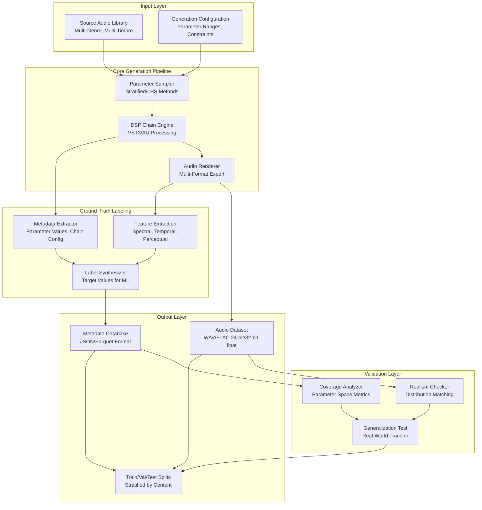
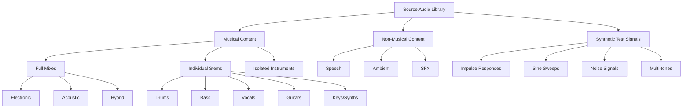
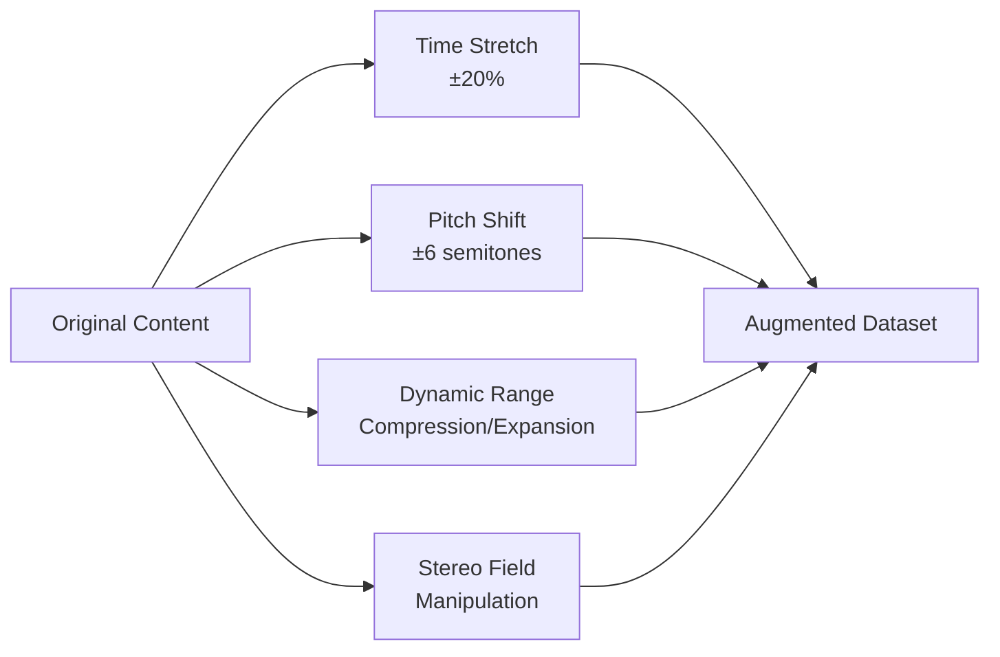
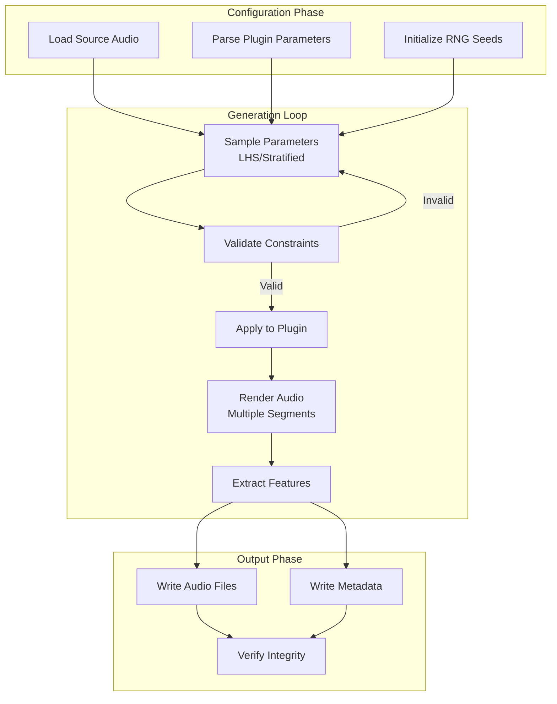
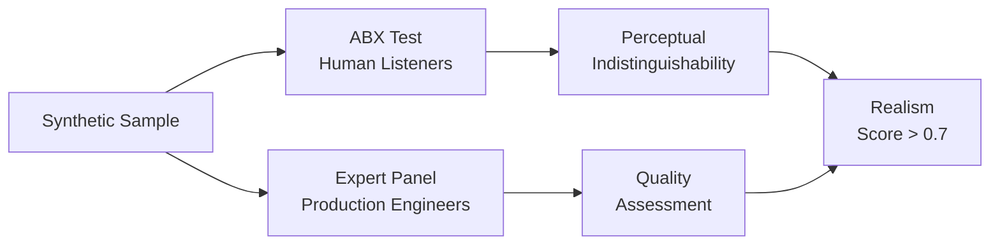
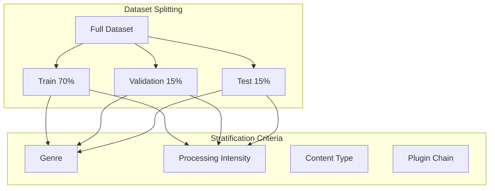

# Comprehensive Methodology for Synthetic Audio Dataset Generation
## Ground-Truth DSP Parameter Dataset for Machine Learning

**Version:** 1.0  
**Date:** 2026-03-03  
**Project:** More-Phi AI Dataset Generation Framework  
**Author:** Architect Mode Analysis

---

## Executive Summary

This document presents a comprehensive technical framework for generating synthetic audio datasets with precisely known ground-truth DSP parameter configurations. The methodology addresses the critical scarcity of publicly available datasets containing verified mastering and mixing parameter values by establishing a controlled generation pipeline that systematically varies processing parameters across diverse audio content.

### Key Innovations

- **Controlled Parameter Space Exploration:** Systematic coverage of DSP parameter configurations using stratified sampling and Latin hypercube sampling
- **Multi-Domain Audio Source Taxonomy:** Structured source material selection ensuring genre, timbre, and dynamic range diversity
- **Physics-Informed Parameter Relationships:** Encoding real-world constraints and dependencies between processing parameters
- **Hierarchical Ground-Truth Labeling:** Rich metadata schema capturing parameter values, processing chains, and acoustic characteristics
- **Synthetic-to-Real Validation Protocol:** Rigorous evaluation ensuring synthetic data transfers to real-world production scenarios

---

## 1. System Architecture Overview



---

## 2. Parameter Space Coverage Strategy

### 2.1 Parameter Taxonomy

#### 2.1.1 Equalization Parameters

| Parameter | Range | Units | Sampling Strategy |
|-----------|-------|-------|-------------------|
| Low Shelf Gain | [-18, +18] | dB | Latin Hypercube |
| Low Shelf Freq | [20, 500] | Hz | Log-spaced |
| Low Shelf Q | [0.1, 2.0] | - | Stratified |
| Low Mid Gain | [-12, +12] | dB | Latin Hypercube |
| Low Mid Freq | [100, 1000] | Hz | Log-spaced |
| Low Mid Q | [0.5, 5.0] | - | Stratified |
| High Mid Gain | [-12, +12] | dB | Latin Hypercube |
| High Mid Freq | [1000, 8000] | Hz | Log-spaced |
| High Mid Q | [0.5, 5.0] | - | Stratified |
| High Shelf Gain | [-18, +18] | dB | Latin Hypercube |
| High Shelf Freq | [2000, 20000] | Hz | Log-spaced |
| High Shelf Q | [0.1, 2.0] | - | Stratified |

#### 2.1.2 Dynamics Processing Parameters

| Parameter | Range | Units | Sampling Strategy |
|-----------|-------|-------|-------------------|
| Threshold | [-60, 0] | dB | Linear-spaced |
| Ratio | [1, 20] | :1 | Log-spaced |
| Attack | [0.1, 100] | ms | Log-spaced |
| Release | [10, 2000] | ms | Log-spaced |
| Knee | [0, 24] | dB | Linear-spaced |
| Makeup Gain | [0, +24] | dB | Linear-spaced |
| Sidechain Freq | [20, 20000] | Hz | Log-spaced (when applicable) |
| Mix/Parallel | [0, 100] | % | Linear-spaced |

#### 2.1.3 Spatial/Imaging Parameters

| Parameter | Range | Units | Sampling Strategy |
|-----------|-------|-------|-------------------|
| Stereo Width | [0, 200] | % | Linear-spaced |
| Mid/Side Balance | [-100, +100] | % | Linear-spaced |
| Pan | [-100, +100] | % | Linear-spaced |
| Haas Delay | [0, 50] | ms | Exponential-spaced |
| Room Size | [0, 100] | % | Linear-spaced |
| Reverb Time | [0.1, 10] | s | Log-spaced |
| Pre-Delay | [0, 200] | ms | Linear-spaced |

#### 2.1.4 Harmonic Enhancement Parameters

| Parameter | Range | Units | Sampling Strategy |
|-----------|-------|-------|-------------------|
| Drive/Saturation | [0, 100] | % | Log-spaced |
| Harmonic Mix | [0, 100] | % | Linear-spaced |
| Character/Type | [0, n-1] | enum | Categorical |
| Output Gain | [-24, +24] | dB | Linear-spaced |
| Tone/Bias | [-100, +100] | % | Linear-spaced |

### 2.2 Sampling Methodologies

#### 2.2.1 Latin Hypercube Sampling (LHS)

For high-dimensional parameter spaces, LHS ensures uniform coverage:

```python
# Pseudocode for LHS implementation
def latin_hypercube_sampling(n_samples, n_params, bounds):
    result = np.zeros((n_samples, n_params))
    for i in range(n_params):
        cut = np.linspace(0, 1, n_samples + 1)
        u = np.random.rand(n_samples)
        a = cut[:n_samples]
        b = cut[1:n_samples + 1]
        rd = u * (b - a) + a
        np.random.shuffle(rd)
        result[:, i] = bounds[i][0] + rd * (bounds[i][1] - bounds[i][0])
    return result
```

#### 2.2.2 Stratified Sampling by Genre

Ensures balanced representation across musical styles:

| Genre Stratum | Percentage | Rationale |
|---------------|------------|-----------|
| Electronic/Dance | 25% | High processing prevalence |
| Rock/Metal | 20% | Complex dynamics requirements |
| Pop | 20% | Polished production standards |
| Jazz/Acoustic | 15% | Subtle processing needs |
| Hip-Hop/R&B | 15% | Specific EQ/dynamics patterns |
| Classical/Orchestral | 5% | Minimal processing baseline |

#### 2.2.3 Physics-Informed Constraint Sampling

Enforces realistic parameter combinations:

```python
# Constraint examples
constraints = {
    # Attack < Release (always)
    "attack_release": lambda p: p["attack"] < p["release"],
    
    # Makeup gain related to threshold and ratio
    "makeup_sanity": lambda p: p["makeup"] <= abs(p["threshold"]) * np.log(p["ratio"]),
    
    # EQ gain limits based on frequency proximity
    "eq_interaction": lambda p: check_eq_spacing(p),
    
    # Sidechain only if compressor active
    "sidechain_logic": lambda p: p["sidechain_freq"] is None or p["ratio"] > 1
}
```

### 2.3 Parameter Space Coverage Metrics

| Metric | Definition | Target Value |
|--------|------------|--------------|
| **Coverage Ratio** | Volume of sampled space / Total parameter space | > 0.8 for principal subspaces |
| **Discrepancy** | Measure of uniform distribution | < 0.05 (low discrepancy) |
| **Mutual Information** | Independence between parameter dimensions | < 0.1 (near-independent) |
| **Boundary Coverage** | Samples near parameter limits | > 10% of samples |

---

## 3. Audio Content Diversity Framework

### 3.1 Source Material Taxonomy

#### 3.1.1 Primary Categories



#### 3.1.2 Content Characteristics Matrix

| Characteristic | Categories | Measurement Method |
|----------------|------------|-------------------|
| **Dynamic Range** | Low (< 6dB), Med (6-12dB), High (> 12dB) | LUFS integrated range |
| **Spectral Centroid** | Dark (< 1kHz), Balanced (1-4kHz), Bright (> 4kHz) | Spectral analysis |
| **Rhythmic Density** | Sparse, Moderate, Dense | Onset detection rate |
| **Harmonic Complexity** | Simple, Moderate, Complex | Chroma entropy |
| **Transient Sharpness** | Soft, Medium, Sharp | Transient-to-sustain ratio |

### 3.2 Content Selection Strategy

#### 3.2.1 Stratified Content Sampling

| Content Type | Target % | Min Duration | Notes |
|--------------|----------|--------------|-------|
| Full Mix - Electronic | 20% | 30s | Representative EDM, techno, house |
| Full Mix - Rock/Pop | 15% | 30s | Live instrumentation focus |
| Full Mix - Acoustic | 10% | 30s | Minimal processing baseline |
| Drum Stems | 15% | 10s | Critical for dynamics training |
| Bass Stems | 10% | 10s | Low-frequency processing |
| Vocal Stems | 15% | 10s | EQ and compression sensitive |
| Instrumental | 10% | 10s | Guitars, keys, synths |
| Test Signals | 5% | 5s | Controlled analysis signals |

#### 3.2.2 Content Augmentation Pipeline



---

## 4. Controlled Generation Pipeline

### 4.1 Pipeline Architecture



### 4.2 Rendering Specifications

#### 4.2.1 Audio Format Standards

| Parameter | Specification | Rationale |
|-----------|---------------|-----------|
| Sample Rate | 48 kHz | Industry standard, Nyquist for 20kHz |
| Bit Depth | 32-bit float | Preserve headroom for processing |
| Channels | Stereo (2) | Spatial processing requirements |
| Duration | 10-30 seconds | Capture temporal characteristics |
| Format | WAV / FLAC | Lossless, wide compatibility |

#### 4.2.2 Rendering Segments

For each parameter configuration, render multiple segments:

| Segment Type | Duration | Purpose |
|--------------|----------|---------|
| Full Render | 30s | Complete feature extraction |
| Transient | 2s | Attack characteristics |
| Steady-State | 5s | Sustain/tail analysis |
| Loop | 4 bars | Rhythmic consistency check |

### 4.3 Plugin Integration Layer

#### 4.3.1 VST3/AU Host Wrapper

```cpp
// Pseudocode for plugin integration
class DSPHostWrapper {
public:
    // Apply parameter vector to hosted plugin
    void applyParameters(const std::vector<float>& params) {
        for (size_t i = 0; i < params.size(); ++i) {
            if (auto* param = plugin->getParameters()[i]) {
                param->setValueNotifyingHost(params[i]);
            }
        }
        // Allow plugin to settle
        processSilence(settleTime_);
    }
    
    // Render audio with current parameter state
    AudioBuffer render(const AudioBuffer& input, int numSamples) {
        AudioBuffer output(2, numSamples);
        int processed = 0;
        while (processed < numSamples) {
            int blockSize = std::min(blockSize_, numSamples - processed);
            processBlock(input, output, processed, blockSize);
            processed += blockSize;
        }
        return output;
    }
};
```

#### 4.3.2 Processing Chain Configuration

| Chain Type | Plugins | Use Case |
|------------|---------|----------|
| **EQ-Only** | Parametric EQ | Frequency response training |
| **Dynamics-Only** | Compressor/Limiter | Transient/gain training |
| **Mastering** | EQ → Compressor → Limiter | End-to-end mastering |
| **Mixing** | Multiple parallel chains | Complex routing scenarios |
| **Creative** | Saturation → EQ → Reverb | Color/tone training |

---

## 5. Ground-Truth Labeling and Metadata Schema

### 5.1 Metadata Structure

```json
{
  "dataset_version": "1.0.0",
  "generation_timestamp": "2026-03-03T18:40:07Z",
  "sample_id": "uuid-v4-identifier",
  
  "source_audio": {
    "file_path": "sources/electronic/mix_001.wav",
    "genre": "electronic",
    "content_type": "full_mix",
    "duration_seconds": 30.0,
    "original_lufs": -14.2,
    "original_dynamic_range": 8.5,
    "spectral_centroid_hz": 2850.0
  },
  
  "processing_chain": {
    "chain_type": "mastering",
    "plugins": [
      {
        "plugin_id": "fabfilter_pro_q3",
        "plugin_name": "FabFilter Pro-Q 3",
        "vendor": "FabFilter",
        "version": "3.25",
        "parameters": {
          "band_1_gain_db": 2.5,
          "band_1_freq_hz": 85,
          "band_1_q": 0.8,
          "band_2_gain_db": -3.2,
          "band_2_freq_hz": 2450,
          "band_2_q": 2.5
        }
      },
      {
        "plugin_id": "waves_ssl_comp",
        "plugin_name": "SSL G-Master Buss Compressor",
        "parameters": {
          "threshold_db": -18.0,
          "ratio": 4,
          "attack_ms": 3.0,
          "release_ms": 300,
          "makeup_db": 4.5
        }
      }
    ]
  },
  
  "output_audio": {
    "file_path": "dataset/audio/sample_000001.wav",
    "duration_seconds": 30.0,
    "lufs_integrated": -11.5,
    "lufs_short_term_max": -9.2,
    "true_peak_db": -0.8,
    "dynamic_range": 6.2,
    "spectral_centroid_hz": 2950.0
  },
  
  "feature_vector": {
    "spectral": {
      "mfcc": [array_of_13_coefficients],
      "spectral_centroid": 2950.0,
      "spectral_rolloff": 8500.0,
      "spectral_flux": 0.045,
      "zero_crossing_rate": 0.12
    },
    "temporal": {
      "rms_energy": [array_per_frame],
      "peak_amplitude": 0.89,
      "crest_factor": 12.5,
      "attack_time_ms": 15.2
    },
    "perceptual": {
      "loudness_lufs": -11.5,
      "roughness": 0.08,
      "sharpness": 2.1,
      "brightness": 0.65
    }
  },
  
  "ml_targets": {
    "parameter_vector_normalized": [0.0_to_1.0_array],
    "parameter_vector_raw": [actual_values],
    "processing_category": "gentle_mastering",
    "processing_intensity": 0.45
  },
}
```

### 5.2 Feature Extraction Pipeline

#### 5.2.1 Spectral Features

| Feature | Extraction Method | Frame Size | Hop Size |
|---------|-------------------|------------|----------|
| MFCC | Librosa/LibXtract | 2048 | 512 |
| Spectral Centroid | Librosa | 2048 | 512 |
| Spectral Rolloff | Librosa | 2048 | 512 |
| Spectral Flux | Custom | 2048 | 512 |
| Chroma Features | Librosa | 4096 | 2048 |

#### 5.2.2 Temporal Features

| Feature | Extraction Method | Window |
|---------|-------------------|--------|
| RMS Energy | Moving average | 50ms |
| Peak Amplitude | Frame max | 10ms |
| Crest Factor | Peak/RMS ratio | 100ms |
| Attack Time | Envelope follower | N/A |
| Transient Density | Onset detection | 1s |

#### 5.2.3 Perceptual Features

| Feature | Standard/Method | Notes |
|---------|-----------------|-------|
| LUFS Loudness | ITU-R BS.1770-4 | Integrated, short-term, momentary |
| True Peak | ITU-R BS.1770-4 | Inter-sample peaks |
| Roughness | Daniel-Weber method | Sensory dissonance |
| Sharpness | Aures method | High-frequency energy |
| Brightness | Spectral slope | Above 1kHz |

### 5.3 Target Label Formats for ML

#### 5.3.1 Regression Targets

```python
# Normalized parameter vector (0-1 range)
regression_target = {
    "type": "parameter_regression",
    "values": [0.0, 1.0],  # Normalized
    "denormalization_bounds": [(min, max), ...],
    "parameter_names": ["low_gain", "high_gain", ...]
}
```

#### 5.3.2 Classification Targets

```python
# Processing style classification
classification_target = {
    "type": "style_classification",
    "categories": [
        "gentle_mastering",
        "aggressive_mastering", 
        "vintage_warmth",
        "modern_clarity",
        "minimal_processing"
    ],
    "one_hot_encoded": [0, 0, 1, 0, 0]
}
```

#### 5.3.3 Multi-Task Targets

```python
# Combined target for multi-task learning
multitask_target = {
    "parameter_regression": [...],
    "style_classification": [...],
    "processing_intensity": 0.45,
    "chain_length_prediction": 3
}
```

---

## 6. Validation Protocols

### 6.1 Realism Validation

#### 6.1.1 Distribution Matching Tests

| Test | Method | Threshold |
|------|--------|-----------|
| Parameter Distribution | Kolmogorov-Smirnov test | p > 0.05 vs real data |
| Feature Distribution | Maximum Mean Discrepancy (MMD) | MMD < 0.1 |
| Spectral Distribution | Wasserstein distance | < 0.05 |
| Temporal Distribution | Dynamic Time Warping | < threshold per genre |

#### 6.1.2 Perceptual Validation



| Validation Method | Participants | Sample Size | Pass Criteria |
|-------------------|--------------|-------------|---------------|
| ABX Testing | 20+ listeners | 100 pairs | 70%+ correct = distinguishable |
| Expert Rating | 5+ engineers | 200 samples | Avg rating > 6/10 |
| Production Use | 3+ producers | 50 samples | Usable in real project |

### 6.2 Coverage Validation

#### 6.2.1 Parameter Space Coverage

| Metric | Calculation | Target |
|--------|-------------|--------|
| Volume Coverage | Convex hull volume / Total volume | > 0.75 |
| Grid Coverage | Occupied grid cells / Total cells | > 0.80 |
| Boundary Coverage | Samples within 5% of limits | > 15% |
| Clustering | Silhouette score | > 0.5 (no excessive clustering) |

#### 6.2.2 Content Coverage

```python
# Coverage analysis pseudocode
def validate_content_coverage(dataset):
    genres = extract_genres(dataset)
    characteristics = extract_characteristics(dataset)
    
    # Genre balance
    genre_entropy = calculate_entropy(genre_distribution)
    assert genre_entropy > threshold, "Imbalanced genre coverage"
    
    # Characteristic variance
    for char in characteristics:
        assert variance(char) > min_variance, f"Low variance in {char}"
        assert coverage_range(char) > 0.8, f"Poor range coverage in {char}"
```

### 6.3 Generalization Validation

#### 6.3.1 Synthetic-to-Real Transfer

| Test | Description | Success Criteria |
|------|-------------|------------------|
| Zero-shot Transfer | Train on synthetic, test on real | < 15% performance drop |
| Fine-tuning | Pre-train synthetic, fine-tune real | > 90% of real-only performance |
| Domain Adaptation | Use domain adaptation techniques | Bridge gap to < 5% |

#### 6.3.2 Cross-Validation Strategy



---

## 7. ML Training Data Formats

### 7.1 Dataset Organization

```
dataset/
├── audio/
│   ├── train/
│   │   ├── electronic/
│   │   ├── rock/
│   │   └── ...
│   ├── validation/
│   └── test/
├── metadata/
│   ├── train_manifest.json
│   ├── val_manifest.json
│   └── test_manifest.json
├── features/
│   ├── spectral/
│   ├── temporal/
│   └── perceptual/
└── targets/
    ├── regression/
    ├── classification/
    └── multitask/
```

### 7.2 Feature Extraction for Training

#### 7.2.1 Waveform-Based Models

| Input Format | Shape | Preprocessing |
|--------------|-------|---------------|
| Raw Waveform | [batch, channels, samples] | Normalize to [-1, 1] |
| Short Segments | [batch, channels, 16384] | Random crop from full |
| Multi-Scale | Multiple resolutions | Downsampled versions |

#### 7.2.2 Spectrogram-Based Models

| Transform | Parameters | Output Shape |
|-----------|------------|--------------|
| STFT | n_fft=2048, hop=512 | [freq_bins, time_frames] |
| Mel Spectrogram | n_mels=128, fmax=8000 | [128, time_frames] |
| Log-Mel | +log compression | Same as above |
| MFCC | n_mfcc=13 | [13, time_frames] |

### 7.3 Training Splits

| Split | Percentage | Selection Criteria |
|-------|------------|-------------------|
| Train | 70% | Stratified by genre + processing type |
| Validation | 15% | No content overlap with train |
| Test | 15% | Held-out genres, real-world samples |

---

## 8. Implementation Roadmap

### 8.1 Phase 1: Foundation (Weeks 1-4)

| Task | Deliverable | Dependencies |
|------|-------------|--------------|
| Parameter sampler implementation | LHS, stratified sampling | - |
| Source audio curation | 1000+ diverse samples | License acquisition |
| Basic rendering pipeline | Single-plugin rendering | JUCE integration |
| Metadata schema definition | JSON schema v1 | - |

### 8.2 Phase 2: Core Generation (Weeks 5-10)

| Task | Deliverable | Dependencies |
|------|-------------|--------------|
| Multi-plugin chain support | Chain configuration DSL | Phase 1 |
| Feature extraction pipeline | Librosa integration | Phase 1 |
| Constraint validation | Physics-informed rules | Parameter analysis |
| Batch generation system | 10k samples/hour throughput | Optimization |

### 8.3 Phase 3: Validation (Weeks 11-14)

| Task | Deliverable | Dependencies |
|------|-------------|--------------|
| Realism metrics | Distribution matching tools | Phase 2 data |
| ABX test framework | Web-based testing | Phase 2 data |
| Coverage analysis | Coverage report dashboard | Phase 2 data |
| Baseline ML models | Simple regression baselines | Phase 2 |

### 8.4 Phase 4: Scale (Weeks 15-20)

| Task | Deliverable | Dependencies |
|------|-------------|--------------|
| Large-scale generation | 100k+ sample dataset | Phase 3 validation |
| Advanced ML models | Transformer/CNN architectures | Phase 3 baselines |
| Documentation | Research paper, API docs | All previous |
| Release | Open-source dataset | Legal review |

---

## 9. Quality Assurance Checklist

### 9.1 Pre-Generation Checks

- [ ] Plugin compatibility verified
- [ ] Parameter ranges validated against documentation
- [ ] Source audio licenses confirmed
- [ ] Random seeds documented for reproducibility
- [ ] Storage capacity verified (estimate: 500GB for 100k samples)

### 9.2 Generation Monitoring

- [ ] Real-time quality metrics logged
- [ ] Failed renders tracked and re-queued
- [ ] Parameter distribution monitored
- [ ] Audio output sanity checked (no silence, no clipping)

### 9.3 Post-Generation Validation

- [ ] All audio files playable
- [ ] Metadata JSON schema valid
- [ ] Feature extraction successful on all samples
- [ ] Train/val/test splits stratified correctly
- [ ] Baseline ML models train without errors

---

## 10. References and Further Reading

### 10.1 Academic Papers

1. **Deep Learning for Audio Processing**
   - "WaveNet: A Generative Model for Raw Audio" (van den Oord et al., 2016)
   - "Music Transformer" (Huang et al., 2018)
   - "DDSP: Differentiable Digital Signal Processing" (Engel et al., 2020)

2. **Dataset Generation**
   - "The NSynth Dataset" (Engel et al., 2017)
   - "FMA: A Dataset for Music Analysis" (Defferrard et al., 2017)

3. **Audio Effects Modeling**
   - "Modeling of Nonlinear Audio Effects" (Eichas et al., 2014)
   - "Neural Parametric Equalizer Matching" (source: recent research)

### 10.2 Technical Standards

- ITU-R BS.1770-4: Loudness measurement
- AES17: Audio measurement standards
- EBU R128: Loudness normalization

### 10.3 Software Libraries

- **JUCE**: Plugin hosting and audio processing
- **Librosa**: Feature extraction
- **Pedalboard**: Audio effects processing
- **PyTorch/TensorFlow**: ML model training

---

## 11. Appendix

### 11.1 Glossary

| Term | Definition |
|------|------------|
| **LHS** | Latin Hypercube Sampling - statistical method for uniform parameter space coverage |
| **LUFS** | Loudness Units relative to Full Scale - perceptual loudness measurement |
| **DSP** | Digital Signal Processing - digital audio manipulation algorithms |
| **MMD** | Maximum Mean Discrepancy - distribution distance metric |
| **ABX Test** | Listening test methodology for perceptual discrimination |

### 11.2 Configuration Examples

See `examples/dataset_generation_config.yaml` for complete configuration templates.

---

**Document Status:** Draft for Review  
**Next Review Date:** 2026-03-10  
**Contact:** More-Phi Architecture Team
